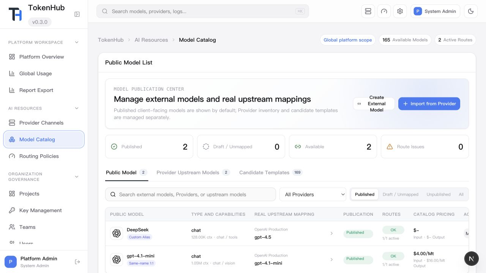

<p align="center">
  
</p>

<h1 align="center">TokenHub</h1>

<p align="center">
  TokenHub is a private enterprise AI gateway with role-based workspaces for users, team leaders, and administrators.
</p>

<p align="center">
  <a href="LICENSE"></a>
  
  
  
  
  
  
  
</p>

<p align="center">
  English | <a href="README.zh-CN.md">简体中文</a> | <a href="README.ja.md">日本語</a>
</p>

## Screenshots

| Login Console | Gateway Overview |
| --- | --- |
|  |  |
| API Documentation | Provider Channels |
|  |  |
| Model Catalog | Routing Policies |
|  |  |
| Usage Analytics | System Settings |
|  |  |

## Designed Around Three Roles

TokenHub separates everyday model usage, team governance, and platform administration so enterprise users see the workflows that match their responsibility.

| Role | Workspace Focus | Guide |
| --- | --- | --- |
| User | Find available models, create project-scoped API keys, call the model API, and review personal usage | [User Guide](docs/user-guide.md) |
| Team Leader | Manage project spaces, project members, project keys, team reports, and project cost attribution | [Team Leader Guide](docs/team-leader-guide.md) |
| Administrator | Configure providers, model catalog, routing policies, identity sources, RBAC, audit, and cost controls | [Administrator Guide](docs/administrator-guide.md) |

## Platform Capabilities

- OpenAI-compatible model APIs: `/v1/chat/completions`, `/v1/responses`, `/v1/embeddings`; Anthropic Messages APIs: `/v1/messages`, `/v1/messages/count_tokens`.
- OpenAI-compatible image generation and reference-image editing through `/v1/images/generations` and `/v1/images/edits`, with asynchronous jobs and server-side image retention; `codex-gpt-image-2` uses Codex subscription capacity, while `gpt-image-2` uses OpenAI API providers. See the [image generation guide](docs/user-guide.md#codex-subscription-image-generation).
- Provider channels for OpenAI-compatible, Azure OpenAI, Anthropic, Gemini, DeepSeek, Qwen, local vLLM/Ollama, and custom upstreams.
- Model catalog and routing policies with priority, weight, failover order, and route health diagnostics.
- Project-scoped key management with team ownership, member permissions, quotas, and concurrency controls.
- Usage analytics and request logs attributed to user, project, team, model, and cost center.
- Identity source configuration for OAuth/OIDC enterprise sign-in, plus RBAC and audit trails.
- Clean console with compact role-aware navigation, global search, light/dark mode, and split-view API documentation.
- SQLite-first private deployment with Docker Compose support.
- PostgreSQL supports multi-instance deployments: share state through remote PostgreSQL, scale frontend and backend replicas horizontally, and configure connection pools. See the [deployment guide](docs/deployment.md).
- Console language switching for English, Chinese, and Japanese.
- TokenHub can also connect OpenAI Codex subscription resources and route selected local Codex CLI or desktop sessions through an isolated, recoverable Codex profile. See the [Codex integration guides](docs/codex-tokenhub-profile-quick-start.md).

## Quick Start

```bash
cp deploy/.env.example deploy/.env
# Replace every change-me value in deploy/.env with a strong secret.
./deploy/install.sh
```

Open:

- Admin console: `http://localhost:3000`
- Backend API: `http://localhost:8080`
- Health check: `http://localhost:8080/healthz`

Initial admin login:

- Username: `admin`
- Password: the value of `TOKENHUB_BOOTSTRAP_ADMIN_PASSWORD`

The deployment script validates production credentials, pulls published images, and starts the containers without building locally. Until the images are publicly available, a failed pull of the default `latest` tag automatically falls back to a local source build; an explicitly selected tag never does. The script reports each unsafe variable without printing secret values. If Compose fails because a backend container created or restarted by that attempt is unhealthy, it automatically shows only that attempt's recent backend logs. Use `./deploy/install.sh --build` to request a local build explicitly.

## Documentation

- [Documentation home](docs/README.md)
- [Architecture](docs/architecture.md)
- [User Guide](docs/user-guide.md)
- [Team Leader Guide](docs/team-leader-guide.md)
- [Administrator Guide](docs/administrator-guide.md)
- [Contributing Guide](CONTRIBUTING.md)
- [简体中文文档](docs/zh-CN/README.md)
- [日本語ドキュメント](docs/ja/README.md)

## Contributors

TokenHub grows through product feedback, gateway integrations, documentation, tests, and the steady care of people who run it in real enterprise environments.

<p align="center">
  <a href="https://github.com/astaxie/TokenHub/graphs/contributors">
    
  </a>
</p>

<p align="center">
  <a href="https://github.com/astaxie/TokenHub/graphs/contributors">View all contributors</a>
  ·
  <a href="CONTRIBUTING.md">Start contributing</a>
</p>

## Star History

[](https://github.com/astaxie/TokenHub/stargazers)

Track TokenHub's growth on the [live Star History chart](https://star-history.com/#astaxie/TokenHub&Date).

## License

TokenHub is licensed under the [Apache License 2.0](LICENSE).
