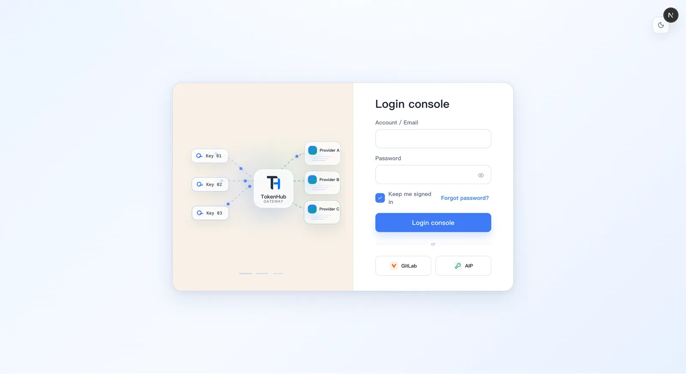

<p align="center">
  
</p>

<h1 align="center">TokenHub</h1>

<p align="center">
  TokenHub gives enterprises a private gateway to unify AI model access and governance, making every request controllable, traceable, and attributable.
</p>

<p align="center">
  <a href="LICENSE"></a>
  
  
  
</p>

<p align="center">
  English | <a href="README.zh-CN.md">简体中文</a> | <a href="README.ja.md">日本語</a>
</p>

## Supported Providers

> [!TIP]
> **Codex subscription ready:** connect OpenAI Codex subscription accounts to TokenHub and serve their models through the same governed gateway as API-based providers. [Set up Codex access →](docs/codex-tokenhub-profile-quick-start.md)

TokenHub includes native adapters for Codex subscriptions, OpenAI, Azure OpenAI, Anthropic, Gemini, DeepSeek, Qwen, and local models, plus a catalog of 150+ provider templates and custom OpenAI-compatible upstreams. Popular integrations include:

<table>
  <tr>
    <td width="20%" align="center" bgcolor="#ffffff"><a href="docs/codex-tokenhub-profile-quick-start.md"></a><br><sub><strong><a href="docs/codex-tokenhub-profile-quick-start.md">Codex Subscription</a></strong></sub></td>
    <td width="20%" align="center" bgcolor="#ffffff"><a href="https://platform.openai.com/docs/models"></a><br><sub><strong><a href="https://platform.openai.com/docs/models">OpenAI</a></strong></sub></td>
    <td width="20%" align="center" bgcolor="#ffffff"><a href="https://docs.anthropic.com/en/docs/about-claude/models"></a><br><sub><strong><a href="https://docs.anthropic.com/en/docs/about-claude/models">Anthropic</a></strong></sub></td>
    <td width="20%" align="center" bgcolor="#ffffff"><a href="https://ai.google.dev/gemini-api/docs/models"></a><br><sub><strong><a href="https://ai.google.dev/gemini-api/docs/models">Google Gemini</a></strong></sub></td>
    <td width="20%" align="center" bgcolor="#ffffff"><a href="https://learn.microsoft.com/azure/ai-foundry/openai/concepts/models"></a><br><sub><strong><a href="https://learn.microsoft.com/azure/ai-foundry/openai/concepts/models">Azure OpenAI</a></strong></sub></td>
  </tr>
  <tr>
    <td align="center" bgcolor="#ffffff"><a href="https://docs.aws.amazon.com/bedrock/latest/userguide/models-supported.html"></a><br><sub><strong><a href="https://docs.aws.amazon.com/bedrock/latest/userguide/models-supported.html">Amazon Bedrock</a></strong></sub></td>
    <td align="center" bgcolor="#ffffff"><a href="https://cloud.google.com/vertex-ai/generative-ai/docs/models"></a><br><sub><strong><a href="https://cloud.google.com/vertex-ai/generative-ai/docs/models">Google Vertex AI</a></strong></sub></td>
    <td align="center" bgcolor="#ffffff"><a href="https://docs.x.ai/docs/models"></a><br><sub><strong><a href="https://docs.x.ai/docs/models">xAI / Grok</a></strong></sub></td>
    <td align="center" bgcolor="#ffffff"><a href="https://api-docs.deepseek.com"></a><br><sub><strong><a href="https://api-docs.deepseek.com">DeepSeek</a></strong></sub></td>
    <td align="center" bgcolor="#ffffff"><a href="https://www.alibabacloud.com/help/en/model-studio/models"></a><br><sub><strong><a href="https://www.alibabacloud.com/help/en/model-studio/models">Qwen / DashScope</a></strong></sub></td>
  </tr>
  <tr>
    <td align="center" bgcolor="#ffffff"><a href="https://platform.moonshot.cn/docs/api/chat"></a><br><sub><strong><a href="https://platform.moonshot.cn/docs/api/chat">Moonshot AI / Kimi</a></strong></sub></td>
    <td align="center" bgcolor="#ffffff"><a href="https://docs.z.ai"></a><br><sub><strong><a href="https://docs.z.ai">Z.AI / GLM</a></strong></sub></td>
    <td align="center" bgcolor="#ffffff"><a href="https://platform.minimax.io/docs"></a><br><sub><strong><a href="https://platform.minimax.io/docs">MiniMax</a></strong></sub></td>
    <td align="center" bgcolor="#ffffff"><a href="https://www.volcengine.com/docs/82379/1330310"></a><br><sub><strong><a href="https://www.volcengine.com/docs/82379/1330310">Doubao</a></strong></sub></td>
    <td align="center" bgcolor="#ffffff"><a href="https://cloud.siliconflow.com/models"></a><br><sub><strong><a href="https://cloud.siliconflow.com/models">SiliconFlow</a></strong></sub></td>
  </tr>
  <tr>
    <td align="center" bgcolor="#ffffff"><a href="https://modelscope.cn/docs/model-service/API-Inference/intro"></a><br><sub><strong><a href="https://modelscope.cn/docs/model-service/API-Inference/intro">ModelScope</a></strong></sub></td>
    <td align="center" bgcolor="#ffffff"><a href="https://openrouter.ai/docs"></a><br><sub><strong><a href="https://openrouter.ai/docs">OpenRouter</a></strong></sub></td>
    <td align="center" bgcolor="#ffffff"><a href="https://console.groq.com/docs/models"></a><br><sub><strong><a href="https://console.groq.com/docs/models">Groq</a></strong></sub></td>
    <td align="center" bgcolor="#ffffff"><a href="https://docs.together.ai/docs/serverless-models"></a><br><sub><strong><a href="https://docs.together.ai/docs/serverless-models">Together AI</a></strong></sub></td>
    <td align="center" bgcolor="#ffffff"><a href="https://fireworks.ai/docs"></a><br><sub><strong><a href="https://fireworks.ai/docs">Fireworks AI</a></strong></sub></td>
  </tr>
  <tr>
    <td align="center" bgcolor="#ffffff"><a href="https://docs.mistral.ai/getting-started/models"></a><br><sub><strong><a href="https://docs.mistral.ai/getting-started/models">Mistral AI</a></strong></sub></td>
    <td align="center" bgcolor="#ffffff"><a href="https://docs.cohere.com/docs/models"></a><br><sub><strong><a href="https://docs.cohere.com/docs/models">Cohere</a></strong></sub></td>
    <td align="center" bgcolor="#ffffff"><a href="https://docs.perplexity.ai"></a><br><sub><strong><a href="https://docs.perplexity.ai">Perplexity</a></strong></sub></td>
    <td align="center" bgcolor="#ffffff"><a href="https://huggingface.co/docs/inference-providers"></a><br><sub><strong><a href="https://huggingface.co/docs/inference-providers">Hugging Face</a></strong></sub></td>
    <td align="center" bgcolor="#ffffff"><a href="https://docs.api.nvidia.com/nim"></a><br><sub><strong><a href="https://docs.api.nvidia.com/nim">NVIDIA NIM</a></strong></sub></td>
  </tr>
  <tr>
    <td align="center" bgcolor="#ffffff"><a href="https://docs.github.com/en/github-models"></a><br><sub><strong><a href="https://docs.github.com/en/github-models">GitHub Models</a></strong></sub></td>
    <td align="center" bgcolor="#ffffff"><a href="https://docs.github.com/en/copilot"></a><br><sub><strong><a href="https://docs.github.com/en/copilot">GitHub Copilot</a></strong></sub></td>
    <td align="center" bgcolor="#ffffff"><a href="https://vercel.com/docs/ai-gateway"></a><br><sub><strong><a href="https://vercel.com/docs/ai-gateway">Vercel AI Gateway</a></strong></sub></td>
    <td align="center" bgcolor="#ffffff"><a href="https://developers.cloudflare.com/ai-gateway"></a><br><sub><strong><a href="https://developers.cloudflare.com/ai-gateway">Cloudflare AI Gateway</a></strong></sub></td>
    <td align="center" bgcolor="#ffffff"><a href="https://docs.ollama.com"></a><br><sub><strong><a href="https://docs.ollama.com">Ollama</a></strong></sub></td>
  </tr>
  <tr>
    <td align="center" bgcolor="#ffffff"><a href="https://lmstudio.ai/docs"></a><br><sub><strong><a href="https://lmstudio.ai/docs">LM Studio</a></strong></sub></td>
    <td align="center" bgcolor="#ffffff"><a href="https://docs.vllm.ai/en/latest/serving/openai_compatible_server.html"></a><br><sub><strong><a href="https://docs.vllm.ai/en/latest/serving/openai_compatible_server.html">vLLM / Custom</a></strong></sub></td>
  </tr>
</table>

Provider templates use the matching native adapter when available; otherwise they connect through an OpenAI-compatible endpoint. Models and capabilities vary by upstream service and account.

## Screenshots

<p align="center">
  
</p>

## Designed Around Three Roles

TokenHub separates everyday model usage, team governance, and platform administration so enterprise users see the workflows that match their responsibility.

| Role | Workspace Focus | Guide |
| --- | --- | --- |
| User | Find available models, create project-scoped API keys, call the model API, and review personal usage | [User Guide](docs/user-guide.md) |
| Team Leader | Manage project spaces, project members, project keys, team reports, and project cost attribution | [Team Leader Guide](docs/team-leader-guide.md) |
| Administrator | Configure providers, model catalog, routing policies, identity sources, RBAC, audit, and cost controls | [Administrator Guide](docs/administrator-guide.md) |

## Platform Capabilities

- OpenAI-compatible model APIs: `/v1/chat/completions`, `/v1/responses`, `/v1/embeddings`; Anthropic Messages APIs: `/v1/messages`, `/v1/messages/count_tokens`.
- OpenAI-compatible image generation and reference-image editing through `/v1/images/generations` and `/v1/images/edits`, with asynchronous jobs and server-side image retention; `codex-gpt-image-2` uses Codex subscription capacity, while `gpt-image-2` uses OpenAI API providers. See the [image generation guide](docs/user-guide.md#codex-subscription-image-generation).
- Provider channels for OpenAI-compatible, Azure OpenAI, Anthropic, Gemini, DeepSeek, Qwen, local vLLM/Ollama, and custom upstreams.
- Model catalog and routing policies with priority, weight, failover order, and route health diagnostics.
- Project-scoped key management with team ownership, member permissions, quotas, and concurrency controls.
- Usage analytics and request logs attributed to user, project, team, model, and cost center.
- Identity source configuration for OAuth/OIDC enterprise sign-in, plus RBAC and audit trails.
- Clean console with compact role-aware navigation, global search, light/dark mode, and split-view API documentation.
- SQLite-first private deployment with native systemd and Docker Compose options.
- PostgreSQL supports multi-instance deployments: share state through remote PostgreSQL, scale frontend and backend replicas horizontally, and configure connection pools. See the [deployment guide](docs/deployment.md) and [PostgreSQL setup guide](docs/postgresql-setup.md).
- Console language switching for English, Chinese, and Japanese.
- TokenHub can also connect OpenAI Codex subscription resources and route selected local Codex CLI or desktop sessions through an isolated, recoverable Codex profile. See the [Codex integration guides](docs/codex-tokenhub-profile-quick-start.md).
- Gemini CLI can connect directly to TokenHub's native Gemini API and use GPT models backed by Codex subscription accounts, without CCswitch. See the [Gemini CLI guide](docs/gemini-cli-codex-subscription.md).

## Quick Start

Native Release on a Linux systemd host:

```bash
curl -fsSL https://raw.githubusercontent.com/astaxie/TokenHub/main/deploy/native/install.sh \
  -o /tmp/tokenhub-install.sh
sudo bash /tmp/tokenhub-install.sh install
```

Docker Compose from a repository checkout:

```bash
cp deploy/.env.example deploy/.env
# Replace every change-me value in deploy/.env with a strong secret.
./deploy/install.sh
```

Open:

- Admin console: `http://localhost:3000`
- Backend API: `http://localhost:8080`
- Health check: `http://localhost:8080/healthz`

Initial admin login:

- Username: `admin`
- Native install password: printed once by the installer
- Docker password: the value of `TOKENHUB_BOOTSTRAP_ADMIN_PASSWORD`

The native installer verifies Release checksums, installs a systemd service, and enables direct update, rollback, and restart controls in the version panel. The default Docker deployment runs the backend and console in one managed container and provides the same direct controls without mounting the Docker socket. Release bundles are stored in the `tokenhub-releases` volume so ordinary container restarts and recreations preserve a panel-applied update. Multi-instance Docker deployments keep operator-managed Compose updates so every replica changes version together. See the [deployment guide](docs/deployment.md) for both modes.

## Documentation

- [Documentation home](docs/README.md)
- [Architecture](docs/architecture.md)
- [User Guide](docs/user-guide.md)
- [Team Leader Guide](docs/team-leader-guide.md)
- [Administrator Guide](docs/administrator-guide.md)
- [Contributing Guide](CONTRIBUTING.md)

## Contributors

TokenHub grows through product feedback, gateway integrations, documentation, tests, and the steady care of people who run it in real enterprise environments.

<p align="center">
  <a href="https://github.com/astaxie/TokenHub/graphs/contributors">
    
  </a>
</p>

<p align="center">
  <a href="https://github.com/astaxie/TokenHub/graphs/contributors">View all contributors</a>
  ·
  <a href="CONTRIBUTING.md">Start contributing</a>
</p>

## Star History

<a href="https://www.star-history.com/?repos=astaxie%2Ftokenhub&type=date&legend=top-left">
 <picture>
   <source media="(prefers-color-scheme: dark)" srcset="https://api.star-history.com/chart?repos=astaxie/tokenhub&type=date&theme=dark&legend=top-left&sealed_token=hWH3kDnssTf49CCLxzq3NVqEp0WTL-HFhsdpQJJz1DUuZt0D-nu1jgXLnhCxrUrMYujv6IJJk12B1wCp5qiU2bU_J03ECSYvb3Y9Pv-gqX7RuwS4SehRrQ" />
   <source media="(prefers-color-scheme: light)" srcset="https://api.star-history.com/chart?repos=astaxie/tokenhub&type=date&legend=top-left&sealed_token=hWH3kDnssTf49CCLxzq3NVqEp0WTL-HFhsdpQJJz1DUuZt0D-nu1jgXLnhCxrUrMYujv6IJJk12B1wCp5qiU2bU_J03ECSYvb3Y9Pv-gqX7RuwS4SehRrQ" />
   
 </picture>
</a>

## License

TokenHub is licensed under the [Apache License 2.0](LICENSE).
