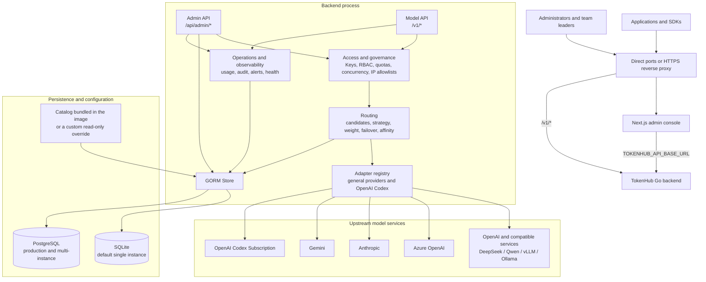
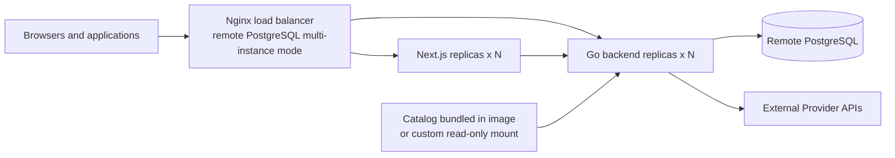

# TokenHub Architecture

Language: English | [简体中文](zh-CN/architecture.md) | [日本語](ja/architecture.md)

This document describes the architecture implemented in this repository for developers, operators, and security teams. TokenHub defaults to a single-instance SQLite deployment and also supports single-instance PostgreSQL and multi-instance deployments backed by remote PostgreSQL.

## Overview

The Go backend hosts the Admin API, OpenAI-compatible model API, routing, provider adapters, audit, and persistence in one process. The Next.js application is the admin console. Control plane and data plane are logical boundaries: they share one backend and database by default, while multi-instance deployments share state through PostgreSQL.



## Planes

| Plane | Entry points and users | Responsibilities | Current implementation |
| --- | --- | --- | --- |
| Control plane | Admin console and `/api/admin/*` | Providers, resources, models, routes, projects, users, keys, quotas, alerts, approvals, and backups | Next.js console and Go Admin API; state is stored in SQLite or PostgreSQL |
| Data plane | Applications and `/v1/*` | Validate project API keys, select routes, call upstream models, return compatible responses | Go `net/http`; Chat Completions, Responses, streaming Responses, `/v1/responses/compact`, and Embeddings |
| Operations plane | Probes, Admin API, deployment tooling | Request audit, usage, route attempts, provider probes, backups, and cluster coordination | Runs in the backend process; PostgreSQL persists coordination state for multi-instance deployments |

## Deployment Modes

| Mode | Compose file | Services and ingress | Database and boundary |
| --- | --- | --- | --- |
| Default single instance | `deploy/docker-compose.yml` | One frontend and one backend; publishes `3000` and `8080` directly | SQLite for development, testing, and single-host private deployments |
| PostgreSQL single instance | `deploy/docker-compose.postgres.yml` | One frontend, one backend, and local PostgreSQL | PostgreSQL for production workloads that need higher concurrency or database governance |
| Remote PostgreSQL multi-instance | `deploy/docker-compose.remote-postgres.yml` | Nginx plus scalable frontend and backend replicas | Managed PostgreSQL for high availability and horizontal scaling |



The default Compose file has no reverse proxy and exposes frontend and backend ports directly. A production deployment may place HTTPS termination in front of it. The remote PostgreSQL Compose deployment includes Nginx and routes `/api/*`, `/v1/*`, `/livez`, `/readyz`, and `/healthz` to backend replicas.

The default image uses the model catalog bundled at build time so the executable and catalog share a version. A custom catalog is an explicit override through `./deploy/install.sh --model-catalog /absolute/path/to/model-catalog.yaml`; it is not a default Compose mount.

## Components and Providers

| Component | Location | Responsibility |
| --- | --- | --- |
| Admin console | `frontend/` | Role-aware console; reads its backend address at runtime from `TOKENHUB_API_BASE_URL`, with `NEXT_PUBLIC_API_BASE_URL` retained only as a compatibility fallback |
| HTTP server | `backend/internal/server/http.go` | APIs, authentication, routed calls, responses, and health endpoints |
| Routing | `backend/internal/server/http.go` | Candidate ordering by priority, resource priority, strategy, weight, and affinity |
| Adapter registry and integration service | `adapter_registry.go`, `integration_service.go` | Declares provider capabilities and runs provider/resource probes |
| Provider adapters | `providers.go`, `provider_account_codex.go` | Protocol translation; Codex subscription OAuth, refresh, and session affinity |
| Store | `store.go` | GORM access, quotas, credential encryption, SQLite backups, PostgreSQL leases, and cluster locks |

| Provider type | Adapter and capabilities |
| --- | --- |
| `openai`, `openai_compatible`, `qwen`, `local` | OpenAI compatible: Chat, streaming Chat, Responses, Embeddings, and probes |
| `deepseek` | OpenAI compatible; Chat, streaming Chat, Embeddings, and probes. Responses and streaming Responses are model-scoped and enabled for `deepseek-v4-flash` and `deepseek-v4-pro` |
| `azure_openai` | Chat, streaming Chat, Embeddings, and probes |
| `anthropic` | Chat, streaming Chat, and probes |
| `gemini` | Chat, streaming Chat, Embeddings, and probes |
| `openai_codex` | OpenAI Codex Subscription: Responses, streaming Responses, models, quota, OAuth, session affinity, and Compact |
| `mock` | Built-in adapter for local verification and tests |

## Model Request Flow

`Model` is the external API contract, `ProviderModel` is a persisted upstream inventory item for one Provider, and `ModelRoute` maps between them. External models carry an explicit persisted directory role, so removing their last route leaves them as drafts instead of turning them back into candidate templates. Route creation and editing require the selected `ProviderModel` to exist in inventory. The narrow exception is the subscription-backed virtual model `codex-gpt-image-2`: its route must target an OpenAI Codex Provider and the fixed upstream model `gpt-image-2`, which is an execution capability rather than a chat-model inventory item. This allows a same-name 1:1 mapping or a custom alias without exposing provider-specific model names to callers. `POST /v1/chat/completions`, `POST /v1/responses`, `POST /v1/responses/compact`, and `POST /v1/embeddings` share the same authentication, quota, and routing entry point.

```mermaid
sequenceDiagram
    participant C as Application
    participant G as TokenHub /v1
    participant S as Store and database
    participant A as Provider adapter
    participant U as Upstream model service

    C->>G: Bearer project API key and model request
    G->>S: Validate key, project, expiration, and IP allowlist
    G->>G: Intersect project and API-key model access
    G->>S: Load applicable content security policies as one snapshot
    G->>G: Inspect, audit, mask, or block user-visible request text
    G->>S: Check quotas and concurrency lease; create call context
    G->>S: Query active and healthy Provider / Resource / Route
    G->>G: Resolve API Key, Project, or Global policy; filter candidates
    G->>G: Plan attempts from strategy, weights, and session affinity
    loop Failover-capable candidate routes
        G->>A: Normalized request and route selection
        A->>U: Provider protocol request
        U-->>A: Response or error
        A-->>G: Normalized response, usage, headers, or error
    end
    G->>S: Store attempts, logs, usage, and resource state
    G-->>C: Compatible response and x-request-id
```

Inactive or unhealthy providers, resources, and routes are skipped, with one exception: a resource whose cooldown has lapsed is readmitted as a half-open candidate. The first request that reaches it claims the trial by pushing its cooldown deadline forward, so concurrent requests are still rejected and a failed trial has already armed the next, longer window. Only that trial's own success closes the breaker and restores the resource without admin action — a request that was already in flight when the breaker tripped cannot resurrect it. Repeated failures widen the window exponentially up to `TOKENHUB_RESOURCE_COOLDOWN_MAX_SECONDS`. A resource an administrator disabled is never readmitted. Non-streaming calls try candidates in order. A stream cannot safely switch upstream after output has started; streaming Responses require an adapter with the `response_stream` capability. `openai_codex` routes can derive a session affinity key from the request and API key, then persist a resource binding for continuity.

For `POST /v1/responses` with `background: true`, the synchronous request flow stops after authentication and durable submission. Every replica polls the durable queue even when it was empty at startup. A worker claims the job, revalidates its original authorization, and commits the admitted phase, request ID, quota counters, token reservation, and concurrency lease in one database transaction before entering the same guardrail, routing, provider, metering, audit, and tracing flow. A lease epoch fences stale workers. PostgreSQL uses row locks with `SKIP LOCKED` across replicas; SQLite uses an atomic claim in the supported single-backend deployment. Pre-admission lease loss is replayable, while post-admission lease loss is terminal rather than risking a duplicate provider request; an undispatched token reservation is refunded during recovery.

Project and API-key model access is an explicit least-privilege layer before route selection: restricted lists are intersected and restricted-empty denies all, while legacy blank modes remain inherited. Scoped routing policies are stored as audited `AdminResource` records of kind `routing-policies`. The runtime selects at most one binding with strict API Key → Project → Global precedence, then intersects its Provider, resource, model, tag, region, and environment constraints with route project scope. A higher-priority binding that is disabled, conflicting, or empty fails closed. Strategy overrides, affinity, half-open recovery, and failover operate only on the filtered candidates. The effective policy ID, scope, and priority are copied into request audit records.

## Security, Health, and Data Boundaries

- Project API keys are validated for hash, status, project state, expiration, model scope, IP allowlist, quota, and concurrency.
- Admin calls use a login session token or `TOKENHUB_ADMIN_TOKEN`; the initial `admin` account is created from `TOKENHUB_BOOTSTRAP_ADMIN_PASSWORD`.
- Non-development startup rejects placeholder values, Admin Tokens or backend secrets under 32 bytes, and bootstrap passwords under 12 bytes.
- `TOKENHUB_TRUSTED_PROXY_CIDRS` defines which proxies may supply `X-Forwarded-For`, `X-Forwarded-Host`, and `X-Forwarded-Proto`; trusted proxies must overwrite those headers. `TOKENHUB_CORS_ALLOWED_ORIGINS` controls credentialed browser origins.
- `/livez` is a process liveness probe. `/readyz` and compatibility `/healthz` check database availability and the database evolution state: they return `503` when the database is unavailable, a migration is dirty or the ledger fails verification, or a blocking data backfill is incomplete. Pending online backfills keep the instance ready.

Provider credentials, billing connector credentials, raw billing snapshots, and persistent background Responses payloads are AES-GCM encrypted from `TOKENHUB_SECRET_KEY`; project API keys retain only a SHA-256 digest plus display prefix and suffix. Every replica must use the same stable secret.

| Category | Key entities | Purpose |
| --- | --- | --- |
| Tenancy and credentials | `Project`, `APIKey`, `AdminUser`, `AdminSession` | Project ownership, application access, and admin sessions |
| Routing | `Provider`, `ProviderResource`, `ProviderModel`, `Model`, `ModelRoute`, `AdminResource (routing-policies)` | Upstream channels, resource pools, upstream inventory, external models, routes, and scoped policy bindings |
| Content security | `guardrails.Policy`, `guardrails.DetectionItem`, `guardrails.Binding` | Project-scoped request inspection, detector configuration, actions, and policy bindings |
| Governance and metering | `QuotaBucket`, `UsageRecord`, `ProviderResourceBucket`, `InFlightLease` | Quotas, usage/cost, and cross-replica concurrency |
| External billing | `BillingConnector`, `BillingRecord`, `BillingRawSnapshot`, `BillingSyncRun` | Provider billing collection, normalization, checkpoints, and sync history |
| Multi-instance coordination | `ClusterLease`, `ClusterTaskState`, `AdapterSessionBinding` | Catalog sync, cluster operations, and Codex session resource bindings |
| Background Responses | `ResponseJob`, `ResponseJobEvent` | Encrypted request/result retention, fenced execution state, cancellation, expiry, and transition audit |
| Observability | `RequestLog`, `RequestPayloadLog`, `RouteAttemptLog`, `ProviderObservation`, `AuditEvent` | Request traceability, payload audit, route attempts, provider observations, and admin audit |

SQLite uses one connection with a five-second `busy_timeout` and must not be shared by backend replicas. PostgreSQL provides pooling, migration advisory locks, in-flight leases, and cluster locks. The built-in backup API is SQLite-only; PostgreSQL should use platform backup tooling such as `pg_dump` and `pg_restore`.

The deployment has no Redis, message broker, or service mesh dependency. Synchronous request and response payloads may be recorded for audit, so production deployments should apply retention, least privilege, disk encryption, and backup access controls. Persistent background Responses are excluded from plaintext payload audit and trace export; their content remains only in the encrypted, TTL-bound job record.

## Related Documentation

- [Deployment](deployment.md): deployment modes, environment variables, reverse proxying, and health checks.
- [PostgreSQL Setup Guide](postgresql-setup.md): PostgreSQL configuration, operations, and migration.
- [Administrator Guide](administrator-guide.md): providers, routes, access control, audit, and cost governance.
- [User Guide](user-guide.md): project API keys and model API calls.
- [Team Leader Guide](team-leader-guide.md): teams, projects, members, and cost attribution.
