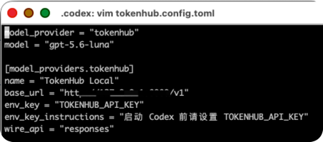
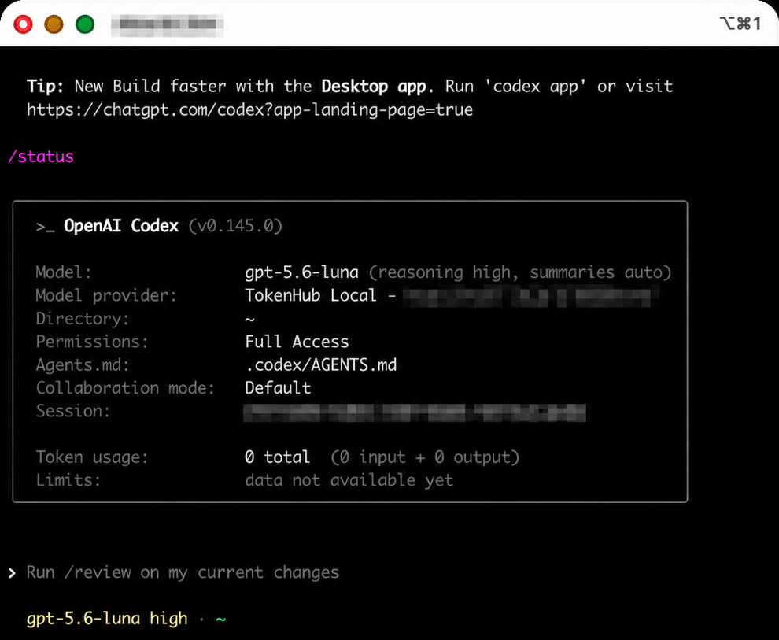

# Connect Codex to TokenHub: Four Configuration Methods and Recovery

Language: English | [简体中文](zh-CN/codex-tokenhub-configuration.md) | [日本語](ja/codex-tokenhub-configuration.md)

> This guide connects local Codex CLI, the Codex desktop app, and the IDE extension to TokenHub. It covers an isolated profile, process-local overrides, global CLI configuration, and desktop configuration.
>
> For the shortest profile-only procedure, see [Profile Quick Setup](codex-tokenhub-profile-quick-start.md).

## 1. Choose a method

| Method | Scope | Persistent | Best for | Recovery |
| --- | --- | --- | --- | --- |
| Isolated profile | Sessions started with the profile | Yes | Selected projects or tasks | Start without `--profile tokenhub` |
| Process-local override | Current process or terminal | No | Initial validation or occasional use | Exit and clear variables |
| Global CLI configuration | Current user's local Codex sessions | Yes | CLI uses TokenHub by default | Restore `config.toml` |
| Desktop configuration | Desktop, CLI, and IDE extension | Yes | Long-term configuration through the app | Restore `config.toml` and restart |

Use the process-local method for initial validation before choosing persistent configuration.

Codex CLI, the desktop app, and the IDE extension share `~/.codex/config.toml`. Trusted project `.codex/config.toml` files cannot override `model_provider`, `model_providers`, or `openai_base_url`; use a profile for isolated provider selection.

The TokenHub console login token is not a project API key. Never commit API keys or place them in shell history. Prefer `env_key`; `experimental_bearer_token` is available only for controlled development use and stores the key in plaintext.

Screenshots must use real configuration or requests. Fully redact keys, authorization headers, login and OAuth tokens, private hosts, usernames, paths, project and account IDs, session IDs, and request IDs.

---

## 2. Prerequisites

### 2.1 Required values

| Value | Source | Requirement |
| --- | --- | --- |
| TokenHub Base URL | Deployment information | Ends with `/v1` |
| TokenHub project API key | **Key Management** in TokenHub | Project API key, not login token |
| Model ID | `GET /v1/models` with the project key | Use an actual `data[].id` |

### 2.2 Set terminal variables

#### macOS zsh

```bash
export TOKENHUB_BASE_URL="enter the actual TokenHub Base URL"
read -r -s "TOKENHUB_API_KEY?TokenHub project API key: "
export TOKENHUB_API_KEY
echo
```

Run the commands in order. After the `read` prompt appears, paste the key and press Enter. No characters or asterisks appear because `-s` disables input echo. `export` makes the value available to Codex; `echo` restores a clean prompt line.

#### Bash

```bash
export TOKENHUB_BASE_URL="enter the actual TokenHub Base URL"
read -r -s -p "TokenHub project API key: " TOKENHUB_API_KEY
export TOKENHUB_API_KEY
echo
```

#### Windows PowerShell

```powershell
$env:TOKENHUB_BASE_URL = Read-Host "TokenHub Base URL (must end with /v1)"
$tokenHubSecureKey = Read-Host "TokenHub project API key" -AsSecureString
$env:TOKENHUB_API_KEY = [System.Net.NetworkCredential]::new("", $tokenHubSecureKey).Password
Remove-Variable tokenHubSecureKey
```

These variables last only for the current terminal session.

### 2.3 Discover models

#### macOS, Linux, or Git Bash

```bash
curl --fail-with-body \
  --url "${TOKENHUB_BASE_URL%/}/models" \
  --header "Authorization: Bearer ${TOKENHUB_API_KEY}"
```

#### Windows PowerShell

```powershell
$tokenHubModels = Invoke-RestMethod `
  -Uri "$($env:TOKENHUB_BASE_URL.TrimEnd('/'))/models" `
  -Headers @{ Authorization = "Bearer $env:TOKENHUB_API_KEY" }

$tokenHubModels.data | Select-Object id
```

Store an actual returned model ID:

```bash
read -r "TOKENHUB_MODEL_ID?Enter an actual model ID from the previous response: "
export TOKENHUB_MODEL_ID
```

PowerShell:

```powershell
$env:TOKENHUB_MODEL_ID = Read-Host "Enter an actual model ID from the previous response"
```

### 2.4 Validate streaming Responses

Model visibility does not prove route health. Codex requires streaming Responses API support.

```bash
curl --fail-with-body --no-buffer \
  --request POST \
  --url "${TOKENHUB_BASE_URL%/}/responses" \
  --header "Authorization: Bearer ${TOKENHUB_API_KEY}" \
  --header "Content-Type: application/json" \
  --data "$(printf '{"model":"%s","input":"Reply only: Connection successful","stream":true}' "$TOKENHUB_MODEL_ID")"
```

PowerShell:

```powershell
$tokenHubRequestBody = @{
  model = $env:TOKENHUB_MODEL_ID
  input = "Reply only: Connection successful"
  stream = $true
} | ConvertTo-Json -Compress

Invoke-WebRequest `
  -Method Post `
  -Uri "$($env:TOKENHUB_BASE_URL.TrimEnd('/'))/responses" `
  -Headers @{ Authorization = "Bearer $env:TOKENHUB_API_KEY" } `
  -ContentType "application/json" `
  -Body $tokenHubRequestBody
```

If TokenHub returns `provider_capability_not_supported`, an administrator must correct the model route or provider resource type.

For the official DeepSeek provider, Responses and Codex are model-scoped and available with both `deepseek-v4-flash` and `deepseek-v4-pro`. Both models support server-side `web_search`, the Codex `apply_patch` custom tool, and `top_logprobs` from 0 through 20, but do not support image or file input. DeepSeek's Responses API is stateless, so clients must send the complete conversation history in `input` on every turn instead of relying on `previous_response_id` or `conversation`. DeepSeek manages context caching automatically. When `TOKENHUB_CACHE_AFFINITY_ENABLED=true`, TokenHub uses stable Codex session hints such as `session-id`, `client_metadata.session_id`, or `prompt_cache_key` to keep successive Responses turns on the same upstream account; this key controls gateway routing and does not create a separate TokenHub response cache.

---

## 3. Method 1: isolated profile

### 3.1 Back up the profile

Profile paths:

- macOS / Linux: `~/.codex/tokenhub.config.toml`
- Windows: `%USERPROFILE%\.codex\tokenhub.config.toml`

```bash
if [ -f "$HOME/.codex/tokenhub.config.toml" ]; then
  cp -p "$HOME/.codex/tokenhub.config.toml" \
    "$HOME/.codex/tokenhub.config.toml.before-edit.$(date +%Y%m%d-%H%M%S)"
fi
```

PowerShell:

```powershell
if (Test-Path "$env:USERPROFILE\.codex\tokenhub.config.toml") {
  $tokenHubBackupTime = Get-Date -Format "yyyyMMdd-HHmmss"
  Copy-Item `
    "$env:USERPROFILE\.codex\tokenhub.config.toml" `
    "$env:USERPROFILE\.codex\tokenhub.config.toml.before-edit.$tokenHubBackupTime"
}
```

### 3.2 Write the profile

```toml
model_provider = "tokenhub"
model = "enter an actual model ID returned by GET /v1/models"

[model_providers.tokenhub]
name = "TokenHub"
base_url = "enter the actual TokenHub Base URL"
env_key = "TOKENHUB_API_KEY"
env_key_instructions = "Set TOKENHUB_API_KEY before starting Codex"
wire_api = "responses"
```

`base_url` must include `/v1`. Do not duplicate the provider table or top-level keys. Codex 0.134.0 and later use a separate `<profile>.config.toml` file.

To store the key directly on a controlled personal development machine, remove `env_key` and `env_key_instructions`:

```toml
[model_providers.tokenhub]
name = "TokenHub"
base_url = "enter the actual TokenHub Base URL"
experimental_bearer_token = "paste your TokenHub project API key here"
wire_api = "responses"
```

Do not combine `experimental_bearer_token` with `env_key`, provider `auth`, or `requires_openai_auth`. Set permissions to `600` and never commit, upload, share, or screenshot the file.



*Figure 1: Real environment-variable profile configuration. The Base URL is redacted.*

### 3.3 Start and validate

```bash
codex --profile tokenhub
codex --profile tokenhub --cd "/enter/the/absolute/project/path"
codex exec --profile tokenhub --cd "/enter/the/absolute/project/path" "enter the real task"
```

Run `/status` and confirm the model, TokenHub provider, and corresponding successful TokenHub request log.



*Figure 2: Profile-enabled `/status`; provider details, window title, and session ID are redacted.*

### 3.4 Recover

Use the default configuration:

```bash
codex
```

Disable the profile:

```bash
mv "$HOME/.codex/tokenhub.config.toml" \
  "$HOME/.codex/tokenhub.config.toml.disabled"
```

Restore a pre-existing profile from its timestamped backup when applicable.

---

## 4. Method 2: process-local override

This method changes no file and applies only to the current Codex process.

```bash
codex \
  -c 'model_provider="tokenhub"' \
  -c "model=\"${TOKENHUB_MODEL_ID}\"" \
  -c 'model_providers.tokenhub.name="TokenHub"' \
  -c "model_providers.tokenhub.base_url=\"${TOKENHUB_BASE_URL}\"" \
  -c 'model_providers.tokenhub.env_key="TOKENHUB_API_KEY"' \
  -c 'model_providers.tokenhub.env_key_instructions="Set TOKENHUB_API_KEY before starting Codex"' \
  -c 'model_providers.tokenhub.wire_api="responses"'
```

PowerShell:

```powershell
codex `
  -c 'model_provider="tokenhub"' `
  -c "model=`"$env:TOKENHUB_MODEL_ID`"" `
  -c 'model_providers.tokenhub.name="TokenHub"' `
  -c "model_providers.tokenhub.base_url=`"$env:TOKENHUB_BASE_URL`"" `
  -c 'model_providers.tokenhub.env_key="TOKENHUB_API_KEY"' `
  -c 'model_providers.tokenhub.env_key_instructions="Set TOKENHUB_API_KEY before starting Codex"' `
  -c 'model_providers.tokenhub.wire_api="responses"'
```

Validate with `/status`. Exit Codex to discard the override. Clear variables when finished:

```bash
unset TOKENHUB_BASE_URL TOKENHUB_API_KEY TOKENHUB_MODEL_ID
```

---

## 5. Method 3: global CLI configuration

User configuration paths:

- macOS / Linux: `~/.codex/config.toml`
- Windows: `%USERPROFILE%\.codex\config.toml`

Back up the file:

```bash
if [ -f "$HOME/.codex/config.toml" ]; then
  cp -p "$HOME/.codex/config.toml" \
    "$HOME/.codex/config.toml.before-tokenhub.$(date +%Y%m%d-%H%M%S)"
fi
```

Merge the same provider block from section 3.2 into `config.toml`. Modify existing keys instead of adding duplicates. You may use `experimental_bearer_token` only under the same restrictions described above.

Validate:

```bash
codex doctor --summary
codex
```

Run `/status` and confirm the request in TokenHub logs.

To recover, restore the backup or return `model_provider` and `model` to their previous values and remove the TokenHub provider table. Restart Codex completely.

---

## 6. Method 4: Codex desktop configuration

The desktop app, CLI, and IDE extension share `~/.codex/config.toml`.

Open:

**Settings → Configuration → Open config.toml**

Back up the file and merge the provider block from section 3.2.

Desktop apps launched outside a terminal usually do not inherit terminal variables. Add the key to `~/.codex/.env`:

```dotenv
TOKENHUB_API_KEY=enter the actual TokenHub project API key
```

```bash
chmod 600 "$HOME/.codex/.env"
```

Never overwrite unrelated `.env` values or include the file in source control or screenshots.

Restart Codex completely, create a local task, confirm the model, and verify the request in TokenHub logs. Local `config.toml` does not control the default model for Codex cloud tasks.

To recover, restore `config.toml`, remove only the `TOKENHUB_API_KEY` line added to `.env`, and restart.

---

## 7. Troubleshooting

| Symptom | Likely cause | Action |
| --- | --- | --- |
| Missing `TOKENHUB_API_KEY` | The process did not receive the variable | Check the variable; restart the desktop app after updating `.env` |
| HTTP 401 / `invalid_api_key` | Missing, malformed, or unrecognized project key | Use a TokenHub project API key, not a console login token |
| HTTP 403 | Disabled or expired key, or disallowed model | Check project, key, model allowlist, and policy |
| HTTP 404 | Wrong Base URL or model ID | Confirm `/v1` and query `GET /v1/models` again |
| HTTP 429 / `quota_exceeded` | Request, token, cost, concurrency, or provider limit | Wait for recovery or adjust policy |
| HTTP 503 / `provider_unavailable` | No healthy route | Check route, provider, and account resource health |
| HTTP 501 / `provider_capability_not_supported` | Route cannot provide Responses or streaming Responses | Change the model route or provider resource |

Check only whether the key exists:

```bash
test -n "${TOKENHUB_API_KEY:-}" && echo "TOKENHUB_API_KEY is set"
```

Configuration precedence:

1. CLI arguments and `--config`
2. Trusted project `.codex/config.toml`
3. Selected profile file
4. User `~/.codex/config.toml`
5. System configuration
6. Codex defaults

## 8. References

- [Codex Config basics](https://learn.chatgpt.com/docs/config-file/config-basic)
- [Codex Advanced Configuration](https://learn.chatgpt.com/docs/config-file/config-advanced)
- [Codex Environment variables](https://learn.chatgpt.com/docs/config-file/environment-variables)
- [Codex Configuration Reference](https://learn.chatgpt.com/docs/config-file/config-reference)
