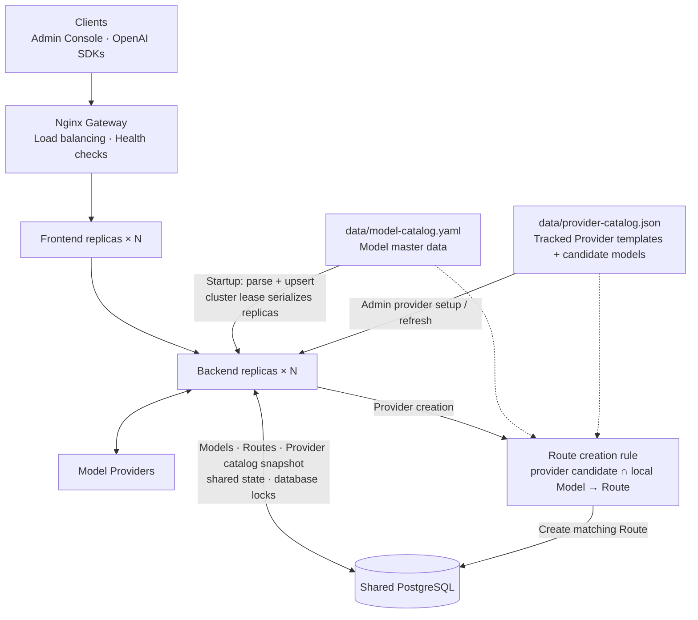

# Deployment

Language: English | [简体中文](zh-CN/deployment.md) | [日本語](ja/deployment.md)

TokenHub is designed for private deployment with a Go backend, a Next.js admin console, and support for SQLite or PostgreSQL persistence.

## Database Selection

TokenHub supports two database backends:

The commands below use Docker Compose. Both backends are equally supported without Docker; see [Bare-metal Deployment](#bare-metal-deployment-without-docker).

### SQLite (Default)

**Advantages:**
- Zero configuration, no separate database service required
- Suitable for small to medium deployments
- Simple backups (direct file copy)

**Use cases:**
- Development and testing environments
- Deployments with fewer than 1000 users
- Single-server deployments

**Deployment:**

```bash
docker compose --env-file deploy/.env -f deploy/docker-compose.yml up -d
```

### PostgreSQL (Production Recommended)

**Advantages:**
- Enterprise-grade database for high concurrency scenarios
- Better transaction support and data integrity
- Supports replication and high availability

**Use cases:**
- Production environments
- Deployments with more than 1000 users
- High-availability requirements

**Deployment:**

```bash
docker compose --env-file deploy/.env -f deploy/docker-compose.postgres.yml up -d
```

For detailed PostgreSQL configuration, see the [PostgreSQL Setup Guide](postgresql-setup.md).

### Multi-instance deployment with remote PostgreSQL

The default installation starts one frontend and one backend with SQLite. For horizontal scaling with PostgreSQL managed outside this Compose project, use `deploy/docker-compose.remote-postgres.yml`. It adds an Nginx gateway in front of scalable backend and frontend services and does not start a local database.



In multi-instance mode:

- Nginx load-balances console, API, and health-check traffic across healthy replicas.
- Backend replicas keep durable configuration, OAuth sessions, quota buckets, audit data, cluster locks, and in-flight concurrency leases in PostgreSQL.
- Lease expiry and ownership decisions use the PostgreSQL clock, avoiding early takeover caused by clock skew between hosts. Heartbeats cancel work when lease ownership is lost.
- The configured model catalog is synchronized on every backend startup; a cluster lease serializes the idempotent synchronization across replicas.
- Provider templates and candidate models are read from the tracked local provider catalog; runtime configuration does not depend on a remote catalog service.
- The backend persists a local Provider-catalog snapshot in PostgreSQL, so replicas serve the same catalog and a missing local file falls back to the seeded built-in templates.
- Coordination failures release provider capacity without incorrectly marking a healthy model provider as failed.

Set the remote `TOKENHUB_DATABASE_URL`, public gateway URL, production secrets, and trusted proxy CIDR, then run:

```bash
docker compose --env-file deploy/.env \
  -f deploy/docker-compose.remote-postgres.yml up -d \
  --scale tokenhub-backend=3 \
  --scale tokenhub-frontend=2
```

All replicas must use the same `TOKENHUB_SECRET_KEY`. Size `TOKENHUB_DB_MAX_OPEN_CONNS` per replica so the combined pool remains below the PostgreSQL connection limit. Never share a SQLite file between backend replicas.

Run the real two-instance PostgreSQL E2E suite with `./deploy/test-multi-instance.sh`.

## Docker Compose

Create a deployment environment file:

```bash
cp deploy/.env.example deploy/.env
```

Edit `deploy/.env` before starting:

- `TOKENHUB_ADMIN_TOKEN`: Admin API bootstrap token. Use a random value of at least 32 bytes.
- `TOKENHUB_BOOTSTRAP_ADMIN_PASSWORD`: Password used only when creating the initial `admin` user. Use at least 12 bytes.
- `TOKENHUB_SECRET_KEY`: Backend secret key. Use a random value of at least 32 bytes and keep it stable.
- `TOKENHUB_IMAGE_TAG`: Shared backend and frontend image tag. Default: `latest`.
- `TOKENHUB_PUBLIC_BASE_URL`: Public backend URL shown to users.
- `TOKENHUB_API_BASE_URL`: Backend URL used by the browser admin console. The frontend server reads it at runtime. The deprecated `NEXT_PUBLIC_API_BASE_URL` remains a fallback for one compatibility cycle.
- `TOKENHUB_BACKEND_PORT`: Host port for the backend. Default: `8080`.
- `TOKENHUB_FRONTEND_PORT`: Host port for the admin console. Default: `3000`.

Start the stack from the repository root:

```bash
./deploy/install.sh
```

The script validates the Compose environment, pulls the published images, and starts the containers without building locally. If the images cannot be pulled during the initial GHCR rollout, it falls back to building from the local checkout. Validation errors name every unsafe variable without printing their values. If Compose fails and a backend container created or restarted by that attempt is exited, restarting, dead, or unhealthy, the script prints up to 100 backend log lines from that attempt. Failures outside the backend do not export unrelated backend logs.

Validate without pulling or starting containers:

```bash
./deploy/install.sh --check-only
```

Use a different environment file with `./deploy/install.sh --env-file /path/to/deploy.env`.

### Published image lifecycle

GitHub Actions publishes `ghcr.io/astaxie/tokenhub-backend` and `ghcr.io/astaxie/tokenhub-frontend` for `linux/amd64` and `linux/arm64`.

- Publishing a GitHub Release builds the exact semantic-version tag. A non-prerelease also updates the major-minor tag and `latest`.
- `workflow_dispatch` can publish `edge` or an isolated `manual-*` tag. It cannot overwrite release or `latest` tags.
- Pull requests do not build or push container images.
- Merges to `main` do not publish images.

Each image is first pushed under a run-specific staging tag. The workflow verifies that both multi-platform images exist before promoting either one to the requested release tags. Both images must use the same `TOKENHUB_IMAGE_TAG`. For reproducible production deployments, pin an exact release tag instead of relying on `latest`.

The first GHCR publication creates private packages. The repository owner must make both packages public before anonymous deployments can pull them. Until then, a deployment using the default `latest` tag remains usable by automatically falling back to a local source build. If an explicit `TOKENHUB_IMAGE_TAG` cannot be pulled, the installer exits instead of labeling current source as that version.

### Optional local build

Build from the current checkout instead of pulling published images:

```bash
./deploy/install.sh --build
```

The following acceleration settings apply only to local source builds.

The project Dockerfiles do not hard-code regional package mirrors. If your server has slow access to Docker Hub, npm, or Go module sources, configure acceleration on the deployment host instead of editing Dockerfiles.

For Docker base image pulls, configure Docker daemon registry mirrors on the server, for example in `/etc/docker/daemon.json`, then restart Docker:

```json
{
	"registry-mirrors": [
		"https://<your-docker-registry-mirror>"
	]
}
```

For dependency downloads during image builds, prefer configuring an outbound HTTP/HTTPS proxy for Docker or BuildKit on the server. This keeps builds portable and avoids committing environment-specific npm or Go proxy settings to the repository.

If you deploy in an environment where direct access to upstream registries is slow, the following server-side examples can be used as references:

```bash
# Go module downloads
go env -w GOPROXY=https://goproxy.cn,direct

# npm package downloads
npm config set registry https://registry.npmmirror.com
```

These commands configure the server or build environment. Do not add them directly to project Dockerfiles unless you intentionally maintain an environment-specific fork.

The compose file starts:

- Backend on `http://localhost:8080`
- Frontend on `http://localhost:3000`
- SQLite data stored in the named Docker volume `tokenhub-data`
- Model catalog included in the selected backend image

Check status:

```bash
docker compose --env-file deploy/.env -f deploy/docker-compose.yml ps
```

Initial admin login:

- Username: `admin`
- Password: the configured `TOKENHUB_BOOTSTRAP_ADMIN_PASSWORD`

For `prod`, `production`, staging, and other non-development environments, startup rejects placeholder values, admin tokens or secret keys shorter than 32 bytes, and bootstrap passwords shorter than 12 bytes.

View or follow logs manually:

```bash
docker compose --env-file deploy/.env -f deploy/docker-compose.yml logs -f
```

Stop:

```bash
docker compose --env-file deploy/.env -f deploy/docker-compose.yml down
```

Stop and remove the SQLite data volume:

```bash
docker compose --env-file deploy/.env -f deploy/docker-compose.yml down -v
```

Only use `down -v` when you intentionally want to delete local data.

## Bare-metal Deployment (without Docker)

`deploy/bare-metal/` runs the same two services with no Docker anywhere. Use it when Docker is unavailable or not permitted. The application is unchanged: the backend is a single Go binary and the console is the Next.js standalone server.

There are two entry points:

| | Use it for | Needs root | Survives reboot |
| --- | --- | --- | --- |
| `run-local.sh` | Running the production build on your own machine | No | No |
| `build.sh` + `install.sh` | Installing on a server under systemd | Yes | Yes |

Both are **SQLite only**. The backend also speaks PostgreSQL, but these scripts do not manage it; see [Database](#database) below.

### Run locally

```bash
./deploy/bare-metal/run-local.sh          # foreground, Ctrl-C stops both
./deploy/bare-metal/run-local.sh -d       # background, returns immediately
./deploy/bare-metal/run-local.sh status
./deploy/bare-metal/run-local.sh logs -f
./deploy/bare-metal/run-local.sh stop
```

Builds both components if needed, then runs them on loopback. The binary, the console bundle, the database, the logs and the pid files all live in `.tokenhub/` inside the repository, which is gitignored; deleting that directory removes every trace. Nothing is installed system-wide and no service account is created.

With `-d` the services detach from the launching shell and keep running after it exits — and after the terminal closes — but not across a reboot; use the systemd installation for that. Both modes write pid files, so `status` and `stop` also work on a foreground instance. `stop` verifies that the recorded pid still belongs to this instance before signalling it, so a recycled pid is never killed by mistake, and both ports are claimed before anything starts so the script cannot report success against an unrelated service already listening.

This is verified on Linux. macOS lacks `setsid`, so the script falls back to walking the process tree when stopping; that path is implemented but untested on macOS.

This runs the **production** build — the same standalone bundle a deployment runs — rather than a dev server, so it surfaces problems that only appear in a production build. It uses development credentials (`admin` / `admin123456`) and binds loopback only, so it is for local use, not a deployment.

Options: `--rebuild`, `--reset` to drop the local database, `--backend-port N`, `--console-port N`, `restart`.

### Requirements

| Host | Requirements |
| --- | --- |
| Build host | Go (the version in `backend/go.mod`), Node 22 or newer, npm, a C compiler |
| Target host | Linux with systemd and GNU coreutils/findutils (standard on every mainstream distribution), Node 22 or newer installed system-wide |

The backend links SQLite through cgo, so a C compiler is required and the resulting binary is tied to the target architecture and libc. Build on a host that matches the target.

Node must be installed system-wide. The service units set `ProtectHome=true`, so an interpreter under a user's home directory (nvm, fnm, asdf) is unreachable at runtime. The installer rejects such an interpreter instead of producing a service that fails later.

### Build a release

```bash
./deploy/bare-metal/build.sh
```

This produces `dist/tokenhub-<version>-<os>-<arch>/` and a matching `.tar.gz`. The directory is self-contained: backend binary, console bundle, both catalogs, unit files, configuration examples, the installer and `SHA256SUMS`. Copy either form to the target host; the target needs no repository checkout and no Go toolchain.

### Install

```bash
sudo ./install.sh --generate-secrets
```

`--generate-secrets` fills `TOKENHUB_SECRET_KEY`, `TOKENHUB_ADMIN_TOKEN` and `TOKENHUB_BOOTSTRAP_ADMIN_PASSWORD` on a freshly created configuration. Without it, a configuration that still holds `change-me-*` placeholders leaves both units installed but **disabled and not started**, because an enabled unit with an invalid configuration would crash-loop on the next boot.

After starting, the installer polls `/readyz` and the console port and prints `systemctl status` plus recent journal entries if either fails.

Useful flags: `--no-start`, `--install-timers` (backup timer for the configured database), `--skip-backup` (skip the pre-upgrade snapshot; not recommended).

### Installed layout

| Path | Owner | Contents |
| --- | --- | --- |
| `/opt/tokenhub/releases/<version>/` | `root:root` | Immutable release payload |
| `/opt/tokenhub/current` | symlink | Active release; switched atomically |
| `/etc/tokenhub/backend.env` | `root:tokenhub` 0640 | Backend configuration and secrets |
| `/etc/tokenhub/frontend.env` | `root:tokenhub-web` 0640 | Console configuration, no secrets |
| `/var/lib/tokenhub/` | `tokenhub:tokenhub` 0750 | SQLite database, backups, pre-upgrade snapshots |

Two service accounts are used: `tokenhub` for the backend and `tokenhub-web` for the console. They never share a configuration file, so a compromised console cannot read the secret key, the admin token or database credentials. The backend unit runs with `UMask=0077`, keeping the SQLite database and its backups private.

### Database

The database lives at `/var/lib/tokenhub/tokenhub.db` and backups at `/var/lib/tokenhub/backups`. Both paths are absolute in `backend.env` on purpose: the built-in defaults are relative to the working directory, which is the read-only release directory here.

The backend can also run on PostgreSQL, but the installer **rejects** such a configuration rather than half-supporting it. Managing PostgreSQL properly would mean owning the preflight checks, the pre-upgrade `pg_dump`, backup retention, and a client toolchain whose version has to track the server's — none of which this installer does. To run TokenHub on PostgreSQL, configure and supervise the backend yourself; see the [PostgreSQL Setup Guide](postgresql-setup.md).

### Backups

`--install-timers` installs a daily timer that calls the backend's own online-backup API and then deletes expired backups. The application records an expiry but never prunes on its own, so retention is driven by the timer. Never copy a live SQLite file instead; the copy would be torn. The backup holds the backend's single SQLite connection for its duration, so it is scheduled off-peak by default, and the static admin token authenticates as the earliest-created admin user — demoting that user breaks the timer.

The timer exits non-zero on failure and logs to the journal; monitor `systemctl --failed` or add an `OnFailure=` unit.

A restore is only useful together with the original `TOKENHUB_SECRET_KEY`, which decrypts stored provider credentials. Back that key up separately. Backups written to the same disk as the database are a local recovery copy, not disaster recovery; copy them off-host.

### Upgrade and rollback

Run `install.sh` from the new release. It stages the payload, verifies checksums, stops both services, takes a **verified pre-upgrade database snapshot**, switches `current` atomically, and restarts. The previous release is retained.

The snapshot is not optional protection: startup runs `AutoMigrate` unconditionally, so pointing `current` back at the old release does **not** roll the schema back. A rollback means restoring the snapshot as well. The snapshot aborts if `-wal`, `-shm` or `-journal` sidecar files remain after the service stops, because the database was then not closed cleanly.

### Uninstall

```bash
sudo /opt/tokenhub/current/uninstall.sh            # keeps /etc/tokenhub and /var/lib/tokenhub
sudo /opt/tokenhub/current/uninstall.sh --purge    # also deletes the database and every local backup
```

### Exposing the services

Both services bind all interfaces by default, exactly like the Compose deployment. For anything beyond a single-machine trial, put them behind a reverse proxy with TLS, restrict the ports with a firewall, and set `TOKENHUB_TRUSTED_PROXY_CIDRS` to the proxy addresses.

`TOKENHUB_API_BASE_URL` in `frontend.env` is rendered into the page and called **by the browser**, not by the Node process:

- `http://127.0.0.1:8080` only works when the console is opened on the server itself.
- A console served over HTTPS cannot call an HTTP API; browsers block mixed content.
- `TOKENHUB_CORS_ALLOWED_ORIGINS` must list the exact console origin — scheme, host and port, with no path.
- The admin session caches the base URL in the browser's local storage, so changing this value does not affect an existing session until the user logs out or clears site data.

## Backend Environment Variables

| Variable | Default | Description |
| --- | --- | --- |
| `TOKENHUB_ENV` | `prod` | Runtime environment label |
| `TOKENHUB_HTTP_ADDR` | `:8080` | Backend listen address |
| `TOKENHUB_PUBLIC_BASE_URL` | `http://localhost:8080` | Public backend URL shown to users |
| `TOKENHUB_TRUSTED_PROXY_CIDRS` | empty | Comma-separated proxy IPs or CIDRs allowed to supply `X-Forwarded-For` |
| `TOKENHUB_CORS_ALLOWED_ORIGINS` | public URL | Comma-separated browser origins allowed to call the backend |
| `TOKENHUB_ADMIN_TOKEN` | `change-me-tokenhub-admin-token` | Bootstrap admin token for Admin API access |
| `TOKENHUB_BOOTSTRAP_ADMIN_PASSWORD` | `change-me-tokenhub-admin-password` | Password for the initial `admin` user; must be changed before production startup |
| `TOKENHUB_SECRET_KEY` | `change-me-tokenhub-secret-key` | Backend secret key |
| `TOKENHUB_DATABASE_URL` | `sqlite:///app/data/tokenhub.db` | Database connection URL (sqlite:// or postgresql://) |
| `TOKENHUB_SQLITE_BACKUP_DIR` | `/app/data/backups` | Backup output directory |
| `TOKENHUB_MODEL_CATALOG_FILE` | `/app/catalog/model-catalog.yaml` | Standard model catalog file |
| `TOKENHUB_PROVIDER_CATALOG_FILE` | `/app/catalog/provider-catalog.json` | Provider templates and candidate-model catalog file |
| `TOKENHUB_SEED_DEMO` | `false` | Whether to seed demo data |
| `TOKENHUB_LOG_LEVEL` | `info` | Log level |
| `TOKENHUB_RESOURCE_FAILURE_THRESHOLD` | `3` | Provider resource failure threshold before cooldown |
| `TOKENHUB_RESOURCE_COOLDOWN_SECONDS` | `300` | Base cooldown before a parked provider resource is given a half-open retry |
| `TOKENHUB_RESOURCE_COOLDOWN_MAX_SECONDS` | `3600` | Upper bound for the exponential backoff applied to repeated recovery failures |
| `TOKENHUB_METRICS_ENABLED` | `false` | Collect Prometheus metrics and serve `GET /metrics` |
| `TOKENHUB_METRICS_TOKEN` | empty | Bearer token for `/metrics`; falls back to the admin token when empty |
| `TOKENHUB_METRICS_PROJECT_LABEL` | `false` | Add `project_id` to gateway metrics; raises series count by the project count |
| `TOKENHUB_IN_FLIGHT_LEASE_TTL_SECONDS` | `300` | Expiry and renewal basis for cluster-wide concurrency leases |
| `TOKENHUB_CLUSTER_LOCK_TTL_SECONDS` | `180` | Expiry and renewal basis for cluster coordination locks |
| `TOKENHUB_GRACEFUL_SHUTDOWN_SECONDS` | `150` | Maximum time to drain in-flight requests during shutdown |
| `TOKENHUB_STOP_GRACE_PERIOD` | `180s` | Compose grace period before Docker force-stops the backend |
| `TOKENHUB_CACHE_AFFINITY_ENABLED` | `false` | Pin a session to one upstream account so the provider's prompt cache keeps hitting. Off by default because it changes routing behaviour |
| `TOKENHUB_CACHE_AFFINITY_MODELS` | empty | Comma-separated model allowlist for staged rollout; empty means every model |
| `TOKENHUB_CACHE_AFFINITY_ALLOW_USER_SCOPE` | `false` | Also accept user-scoped identifiers as affinity keys; off by default because one user's concurrent sessions would share a single account |
| `TOKENHUB_DB_MAX_OPEN_CONNS` | `25` | Maximum open database connections (PostgreSQL only) |
| `TOKENHUB_DB_MAX_IDLE_CONNS` | `5` | Maximum idle database connections (PostgreSQL only) |
| `TOKENHUB_DB_CONN_MAX_LIFETIME_MINUTES` | `30` | Maximum connection lifetime in minutes (PostgreSQL only) |

## Frontend Environment Variables

| Variable | Default | Description |
| --- | --- | --- |
| `TOKENHUB_API_BASE_URL` | `http://localhost:8080` | Backend Admin API URL read by the frontend server at runtime |
| `NEXT_PUBLIC_API_BASE_URL` | empty | Deprecated compatibility fallback; migrate to `TOKENHUB_API_BASE_URL` |

## Data and Backups

SQLite is the persistent source for projects, keys, Providers, routes, users, request logs, usage, alerts, approvals, sessions, and backup records.

In the one-command compose deployment:

- Database path inside the backend container: `/app/data/tokenhub.db`
- Backup path inside the backend container: `/app/data/backups`
- Docker volume name: `tokenhub-data`

Recommended production setup:

- Store the SQLite database on a persistent disk.
- Store backups outside the application container.
- Rotate old backups according to your retention policy.
- Keep provider credentials and admin tokens in a secret manager or protected environment variables.

## Catalog Files

Published backend images include the matching `data/model-catalog.yaml` and `data/provider-catalog.json` at `/app/catalog/`. Default deployments use these copies so the backend binary and both catalogs always come from the same image version. The Provider catalog is vendored from PublicProviderConf and is read locally at runtime; TokenHub does not fetch remote catalog data.

To mount a custom catalog explicitly:

```bash
./deploy/install.sh --model-catalog /absolute/path/to/model-catalog.yaml
```

After editing the configured catalog file, restart the backend or use **Restore Factory Catalog** in the admin Model Catalog page to re-import the current file without removing manually added models.

The custom mount intentionally overrides the image catalog and is therefore managed separately from `TOKENHUB_IMAGE_TAG`. After updating that file, restart the backend container and confirm the entries in `Model Catalog`.

`data/model-catalog.yaml` remains the model master data and route allowlist. `data/provider-catalog.json` provides Provider templates and candidate models; a route is created only when its candidate also exists in the model catalog. To use a custom Provider catalog, set `TOKENHUB_PROVIDER_CATALOG_FILE` to a local JSON file using the same `providers` structure.

## Reverse Proxy

For production, place TokenHub behind HTTPS and forward:

- Admin console traffic to the frontend service.
- `/v1/*` and `/api/admin/*` traffic to the backend service.

Set request body and streaming timeouts high enough for long model responses.

Use `/livez` for liveness and `/readyz` for readiness. `/readyz` and the backwards-compatible `/healthz` return `503` when the database is unavailable.
