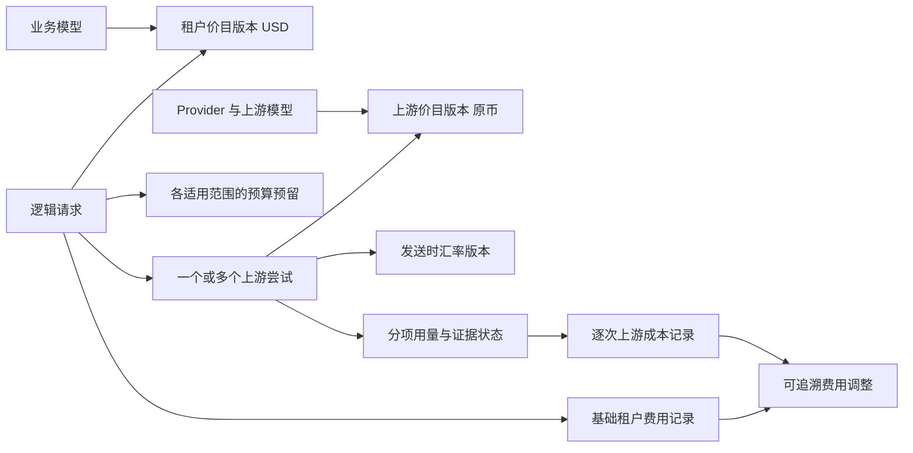
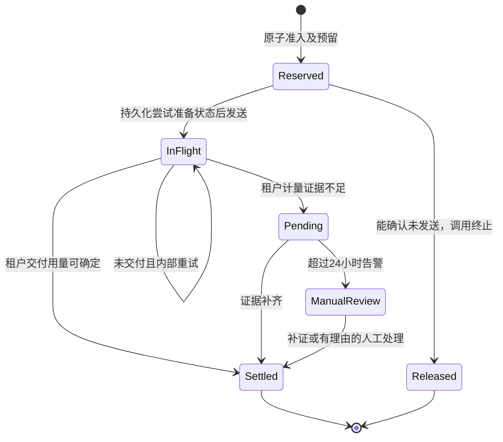

# TokenHub 峰谷与缓存计费设计

状态：业务决策 Q1–Q18 已确认；本稿汇总及工程细节待最终共同理解确认。已补充关联 issue 范围并通过 8 项已有聚焦回归测试；尚未实施新方案或验证供应商账单一致性，新增验收矩阵仍待执行。

日期：2026-09-05。代码事实已刷新到 `076a1b2d53ba61a4d99db690533ac2a5f1e5b9c4`。来源、访谈过程及原始阅读入口见[访谈记录](2026-09-05-time-cache-billing.md)。

## 1. 目标与边界

同一请求需要能解释：为什么属于高峰或空闲、哪些输入命中缓存、使用哪一版价格、上游花了多少、业务侧记了多少费用，以及这笔费用如何影响预算。

首期演进现有模型定价、用量归集和预算控制，使用通用计价模型，先验证 DeepSeek。上游成本和租户费用使用独立价目。首期租户价目、金额限额与预算保持 USD，上游保留实际价目币种和原币金额。

“租户费用”是收费领域概念：当前代码归属实体为 Project、Team、CostCenter、User、APIKey 及组织范围，不新增 Tenant 实体或逐用户议价系统。沿用既有模型售价范围，不将供应商报价自动变成租户售价。

首期不新增充值钱包、网关响应缓存、低谷任务排队、按时段自动换供应商、缓存亲和路由或响应重放型幂等 API。保留现有路由评分行为，公开目录价格更新只生成待管理员确认的候选变更。

决策依据：[费用边界 ADR-0009](../adr/0009-separate-provider-cost-and-tenant-charge.md)、[价格与币种 ADR-0010](../adr/0010-preserve-billing-price-and-currency-evidence.md)、[预算与重试 ADR-0011](../adr/0011-reserve-budget-and-separate-attempt-costs.md)。术语见[领域语言](../../CONTEXT.md)。

## 2. 核心不变量

1. 输入总量及其缓存子集不能重复收费；缓存写入有效期总量和分项不能重复收费。
2. 未知用量、缺价或缺汇率与明确的零用量、免费、同币种不换汇分别表示。
3. 租户准入时锁定价目版本、适用时段和归属主体；一次请求不能因中途改价、重试或跨时段重选租户售价。
4. 每次上游尝试独立保留价格、时间、币种和汇率依据；上游失败尝试的成本不转嫁租户。
5. 对所有适用预算/金额限额，准入原子检查 `已用金额 + 未结算占用 + 本次预留 <= 限额`，并在同一事务内预留。
6. 一个逻辑请求只产生一份基础租户结算；重复执行结算、释放和调整不会重复影响金额。
7. 本地计价完成不等于供应商对账完成；usage 完整也不意味着上游时间规则已确认。
8. 原价目和已结算记录不被改写；补证、对账差异及管理员纠错通过有来源的调整记录表达。
9. 金额预算统一按准入时的 UTC 周期归属。费用确认、释放和调整引用原周期，不因后台处理时间改变归属。
10. 同一请求及证据版本的计价、持久化统计与客户端 usage 使用同一归一化结果，按协议投影；不能要求不同协议的同名输入字段数值相同。
11. 调用归属用户、项目、API Key 与上游资源账号是不同身份，不通过互相填充名称掩盖缺失归属。

## 3. 领域关系与数据建议

下列对象名及字段为工程建议，待整体确认，不是已经存在的数据库结构。

| 对象 | 最小信息 | 约束与归属 |
| --- | --- | --- |
| `RateCardVersion` | 成本/租户类型、业务模型或 ProviderModel、币种、版本、发布时间、生效区间、来源、默认分项单价 | 发布后不可变；生效区间起含止不含；同一适用范围不可多版同时生效 |
| `TariffWindow` | 时区、星期、日内窗口、分项覆盖及继承关系 | 默认价兜底；同一版本的时段覆盖不可重叠 |
| `ExchangeRateVersion` | 原币/目标币、汇率方向与值、生效区间、发布人、来源 | 明确 `1 原币 = x USD`；上游发送时选择并保留版本 |
| `BillingRequest` | 服务端逻辑请求 ID、调用方、归属主体快照、业务模型、准入时间、租户价格快照、输出约束 | 不以客户端自填 request_id 作为全局免费去重凭据 |
| `BudgetReservation` | 请求、scope 类型/ID、周期、原始预留、剩余占用、状态 | 请求加 scope 加周期唯一；各 scope 分别检查，但不是多次收取租户费用 |
| `BillingAttempt` | 请求、尝试序号、Provider/资源/模型、上游请求 ID、准备/发送/完成时间、交付状态、原币及汇率依据 | 尝试序号在逻辑请求内唯一；发送结果不明确要保留不确定性 |
| `UsageEvidence` | 用量协议、原始计量字段、标准分项、字段是否存在、计量来源、规范化版本 | 只留必要计量证据；不为计费保存完整 prompt、响应正文或凭据 |
| `ChargeRecord` | 租户基础费用或逐次上游成本、分项数量/实际单价、未舍入依据、金额、币种、依据状态 | 原始记录不可覆盖；基础租户费用与逐次成本分别唯一 |
| `BillingAdjustment` | 原记录、差额、原因、证据/管理员、作用对象、幂等键、原归属周期 | 仅修改指定费用及相应投影，不能自动把上游差异转到租户 |

请求级快照至少包含版本 ID 和命中的分项价格、时段、时间依据及币种；只保存当前 Model ID 不足以重演。归属主体也在准入固定，团队迁移或 API Key 改绑不能改变在途请求及历史费用归属。

## 4. 缓存与协议归一

建议标准计费分项：`input_uncached`、`input_cache_read`、`input_cache_write_5m`、`input_cache_write_1h`、`input_cache_write_other`、`output`。供应商不支持的分项明确为不适用，不强制给 DeepSeek 添加缓存写入费用。

适配器先解释供应商原始 usage 的包含关系，再产生互不重复的分项。不同协议中 input_tokens 是否包含缓存读取/创建不能统一假设；为每种已支持路径提供固定样例。写入总量若同时有 5m/1h 细分，只收各细分及合法剩余部分，不再对总量收费。reasoning、文本和图像等子项若已包含在上级 token 中，不重复相加；本期不扩展新的多模态计费合同。

DeepSeek Chat 的 `prompt_tokens = prompt_cache_hit_tokens + prompt_cache_miss_tokens`，依据为[官方 usage 文档](https://api-docs.deepseek.com/zh-cn/api/create-chat-completion/)。三项齐全时交叉校验；总量与一个可靠缓存分项完整时，可按已确认合同推导另一个分项并标记为派生。只有总量时保留缓存分解未知。字段冲突、负数或分项超过总量时进入待核实，不能静默归零或截断后当最终费用。

缓存价有三种清晰状态：明确数值（包括免费零价）、时段项继承默认价、未知/未配置。租户价目的基础必需分项缺失不得发布；上游缺价允许记录成本未知，但不能从租户价反推。

与历史 #208 的回传修复衔接：归一化、金额计算、UsageRecord/统计与客户端响应共用一份计量依据，各协议序列化器仅作合同投影。例如内部总输入 90、缓存读 80、缓存写 0 时，OpenAI 可表达总输入 90 和缓存明细 80，Anthropic 表达普通输入 10 和缓存读 80；两者应与内部同一证据一致，不能为了字段相等破坏协议。流式早期估算与最终权威块分别标明，补证引起的后续账目调整保留原证据版本，不回写已经发送的响应。

PATCH 语义也须按字段合同区分：未提供表示不修改；明确零值按该字段含义处理；继承是显式配置状态。已有额度清零表示清除相应限额，不是价格免费；不得套用一个通用“零值忽略”规则。配置验收覆盖表单、请求解析、持久化、回读及真实计价，不能只检查 PATCH 返回 200。

缓存折扣影响金额，不修改实际 token 数或自动重定义 TPM/token quota。现有跨失败尝试的限流累计与只按交付计算的租户费用是不同投影，分别保持合同与测试，关联 #83。

## 5. 时段、版本与汇率

价目由带 IANA 时区的每周规则、日内窗口和绝对生效区间组成。全部边界起含止不含。午夜跨越规则按窗口开始日归属其星期条件，再拆分验证相邻日冲突；默认全天价覆盖剩余时间。首期不隐式应用中国调休、节假日或“工作日”日历，按明确星期集合执行。

当前 [DeepSeek 中文价格页](https://api-docs.deepseek.com/zh-cn/quick_start/pricing/)的高峰为北京时间周一至周五 09:00–12:00、14:00–18:00，其余为空闲。可表达为 `Asia/Shanghai`、周一至周五、两个窗口；三项单价分别覆盖，不把高峰两倍写成通用引擎常量。

| 依据 | 选择时间 | 重试与后续更正 |
| --- | --- | --- |
| 租户价格与时段 | 平台准入时 | 全部内部重试沿用；改价和跨时段不影响在途请求 |
| 租户预算周期 | 准入时的 UTC 日/月 | 后续释放和调整关联原周期 |
| 上游价目 | 每次尝试按供应商正式规则选择 | 不同尝试可以使用不同版本；记录选择依据 |
| 上游汇率 | 每次尝试发送时 | 保留所用版本；后续管理员改汇率不重写记录 |

DeepSeek 跨峰谷请求的计价时间点尚未由本轮查到的官方资料确认。暂以每次上游发送时点选择上游价格，标为时间依据估算。即使供应商用量完整，该成本仍不能标记为已确认供应商费用。未来获得正式规则后增加新规则版本；历史差异通过调整与对账处理。

对采用完成时间定价的其他供应商，须在发送时捕获不可变候选价目集合和规则依据，完成后按正式时间点选择其中适用窗口；本稿不把 DeepSeek 暂估规则强加给其他供应商。缺少足够规则证据时保持成本待核实。

缺汇率只导致成本 USD 折算待定，原币成本仍可计算；独立 USD 租户价目和预算继续执行。成本汇总显示已知部分、待核实数量和完整性状态，不把未知部分当零，不展示未经证实的精确利润。

## 6. 金额精度与算例（工程建议，随本稿确认）

用整数 token 数及十进制价格进行精确计算。建议单价和汇率最多 12 位小数，已记账金额保留 12 位小数，采用 half-even；在一条费用记录所有分项精确求和后舍入一次。原币折算从保留的未舍入计价表达式计算，避免先舍入原币再换汇造成二次误差。预算预留向上取到相同金额精度，不能向下舍入。

实现使用精确十进制或整数/有理数运算，禁止经过 float64。金额对外以规范十进制字符串传输，数据库需保持同等精度；SQLite 不可把 NUMERIC 自动转 REAL 后使用浮点 SUM，预算投影更新应在持锁事务内精确计算。超出支持精度或金额范围明确报错，不截断。旧 float 字段只作兼容展示，不能成为新预留判定来源。

展示可以按语言格式化更少小数，但账目导出保留计费精度。分项展示与总额因显示舍入产生的差值须解释，不能把显示值重新入账。原币、USD 成本、租户 USD 费用各自聚合；不混合币种求和。

**验证算例**：DeepSeek Flash 输入共 1,000,000 tokens，其中命中 800,000、未命中 200,000，输出 10,000。按本轮价格页，空闲成本为 `(800000×0.05 + 200000×1.5 + 10000×4.5)/1000000 = 0.385 CNY`，高峰为 `0.77 CNY`。若管理员配置独立租户价为缓存读 0.5、未命中输入 2、输出 6 USD/百万 tokens，且无租户峰谷覆盖，则租户费用均为 `0.86 USD`。

仅用于算例的汇率若为 `1 CNY = 0.14 USD`，空闲成本折算为 `0.0539 USD`。该汇率和租户售价为演示配置，不是当前市场汇率或已配置生产价格。改变上游成本不能自动改变示例租户费用。

## 7. 预算准入与结算

预留采用本请求允许的计费组合费用上界：可靠输入上界、缓存读写可能组合、允许的输出上限及已锁定租户价格。普通输入全部未命中仅是 DeepSeek 的特定保守场景，不能忽略可能更贵的缓存写入。未提供输出上限时使用明确、可强制执行且对调用方可知的已有上限；无法建立可靠费用上界的严格预算请求拒绝并解释配置原因。

采用稳定顺序锁定全部适用 scope 和周期，一次事务检查金额并创建全部预留。任一限制不满足，整个准入回滚，不留下部分 scope 占用。重试复用同一逻辑请求预留；输出已开始交付后不能再启动会产生第二份交付的透明重试。异常上游实际用量超过预留时如实记录与告警，不裁剪账目以伪造零超支。

基础租户费用、各 scope 已用金额、预留释放和完成标记应原子提交。收集上游每次尝试的必要计费证据必须可靠持久化；现有忽略写入错误的 attempt 日志不能直接充当成本账本。发送前持久化尝试状态，但数据库事务不能与外部 HTTP 形成原子提交：崩溃后只能确认“可能已发送”时，进入待核实，不因租约到期自动释放。

数据库作为金额账目与预留的持久化事实来源。保留现有 PostgreSQL 事务锁和 Redis Lua 限流/计量能力，Redis 可用于加速与可重建投影；不得把数据库与 Redis 各自成功视为跨系统原子提交。验收必须覆盖两个独立服务实例、同一用户多把 Key、事务失败、Redis 故障/重复通知和恢复重放。金额控制及结算相关部分纳入本次，仓库其余分布式并发问题不据此一并宣称解决。

进程重启的恢复任务按持久化状态接管预留，不重发已经可能送达的上游请求。未结束的实际长请求与结束后缺失 usage 要区分，24 小时从请求终止或被判定为孤立待核实时开始计时；转人工不代表自动收费或释放。人工减免属于有理由的调整，原用量未知状态仍保留。

租户与上游确认状态独立。只有成本价格、成本汇率或内部失败尝试用量未知，而成功交付的租户用量可确定时，租户仍可正常结算并释放预算；不能因供应商对账未完成无限占用租户预算。租户分项本身未知时则保留占用，界面分别展示已确认费用与待核实占用，避免两次累计。

## 8. 交付、重试与调整

| 场景 | 租户费用 | 上游成本与证据 |
| --- | --- | --- |
| 准入拒绝或确认未发送上游 | 不产生本次费用，释放已存在预留 | 无调用成本 |
| 平台失败重试后成功 | 成功交付对应的一份费用 | 每次尝试分别记录；失败成本由平台承担 |
| 最终失败且未交付任何输出 | 不转嫁平台失败尝试费用 | 保留已知成本与未知状态 |
| 部分交付后断开 | 可确认的交付用量计费，其余待核实 | 上游生成量不等于确认交付量，分别保存 |
| 客户端主动重发 | 默认新逻辑请求 | 新尝试独立记录 |
| 重复回调或后台重复结算 | 同一基础结算只生效一次 | 同一尝试成本不得重复写入 |
| 后续供应商账单出现差异 | 不自动调整租户费用 | 对原成本记录追加差额并保留账单依据 |

部分交付的精确用量不能简单从已发送字符数反推。若只能取得整次上游 completion 用量而无法可靠分离交付部分，不标为精确租户用量；可记录本地估算及方法版本，交由补证或人工处理。输入、输出和推理等分项必须按已选收费合同及可靠证据解释，不把上游全部生成量冒充用户已收到的量。

每个逻辑请求、尝试、基础费用和调整均有服务端唯一标识。幂等键带计费对象及作用范围，客户端 trace/request ID 仅用于关联。调整在锁内对照目标已确认金额计算差额，重复事件重放无额外影响；已结算后再补证不重新创建基础费用。

## 9. 管理界面与权限

- **模型价目**：区分租户价目和上游成本价；配置默认分项价、星期/时区/时段覆盖、生效区间，区分继承、缺失、免费。以表单及预览替代仅靠时段 JSON 判断结果；预览显示指定时间命中的规则及示例费用。
- **发布与变更**：展示版本差异、来源、生效时间和受影响模型。公开目录更新生成候选，不直接发布；发布、停用及纠错按既有管理员权限记录审计。停止新请求使用某版本不能删除在途及历史引用。
- **费用明细**：授权调用用户可见输入缓存分项、输出、租户价格版本、计费时段、费用、预算占用和待核实原因。导出和 API 与页面遵循相同权限。
- **成本与对账**：仅获授权角色可见各上游尝试、原币、折算、汇率依据和差异；普通用户不新增供应商成本或利润可见性。
- **人工处理队列**：列出超过 24 小时的待核实项、预留、缺失证据、重试和处理历史。补证、释放或调整需权限、理由和审计；拒绝权限不足、重复提交或跨范围操作。

沿用现有用户/项目等授权范围。新增 UI 文案保持中文 canonical `tx()`，同步英文、日文；日期、金额和数字按所选语言显示，但不会改变预算 UTC 周期和价目时区。

**归属显示（关联 #304）**：账目固定归属 ID 和必要的非敏感显示名称快照；可读名称是显示信息，不是连接账目的主键。分别展示用户、项目、API Key、Provider 与资源账号。项目/资源改名后仍能解释调用时归属；删除后保留历史证据。状态区分未归属、已确认删除、名称暂不可用与受权限限制，不能仅因前端列表未加载到对象就断言已删除。不得用 API Key 所属用户名代替上游账号；名称快照和明细接口遵循当前授权，历史快照不会扩大数据可见范围。

供应商账单导入与对账接续现有模块，新增版本与分项证据作为解释和差异处理输入；不另建一套互不相认的账单系统。

**报表日界（关联 #266）**：仪表盘可按配置时区显示“今日”，金额预算仍按已确认的 UTC 周期归属。分别展示报表实际起止时间与时区、预算周期及金额依据；不可因两者时间窗口不同就将差额判为重复扣费。报表导出携带同样的窗口和依据，跨日/月调整仍关联原预算周期。

## 10. 实施阅读顺序与拆分

| 阶段 | 阅读入口 | 交付与风险 |
| --- | --- | --- |
| 1. 价格与用量合同 | `model_pricing_period_types.go`、`pricing_periods.go`、`providers.go`、`store_backup_quota.go` | 分项归一、星期、明确免费/未知、纯计价；避免在超长文件广泛重构 |
| 2. 快照与精确金额 | `types.go`、`provider_model_cost.go`、`provider_models.go`、数据库迁移机制 | 不可变价目/汇率、精确金额、请求和尝试快照；原币与兼容 USD 字段分开 |
| 3. 预算生命周期 | `store_call_admission.go`、`store_routing_calls.go`、`store_helpers.go` | 全 scope 原子预留、跨周期一致性、崩溃恢复、基础结算及调整幂等 |
| 4. UI 与对账 | `frontend/features/admin/resources/provider-model-config.tsx`、`payloads.tsx`、`frontend/features/admin/domain/model-pricing-periods.ts` | 配置、预览和发布；后端入口 `admin_providers_http.go`、`provider_models.go` |
| 5. 使用与迁移 | `frontend/features/admin/views/usage-billing.tsx`、`billing-reconciliation.tsx`、`admin_billing_routing.go` | 待核实状态、管理员处理、原币对账与历史兼容 |

上表省略的后端路径前缀均为 `backend/internal/server/`。固定阅读行号和现状证据见访谈记录；实施前再次刷新 HEAD、工作区和适用指引。

职责建议：协议适配器只提供标准计量证据；纯计价模块选择规则并计算分项；预算模块控制准入/结算占用；账目与对账模块维护记录及调整；UI 调用统一预览与发布接口。不要让供应商插件或 UI 独立决定最终租户费用。

## 11. 迁移与切换

1. 先扩展结构、精确金额和版本读取能力，不删除旧字段。历史请求金额保持原样；缺失价目/分项/汇率的记录标记历史依据不足。
2. 为新请求建立明确生效的新价目版本。旧配置中“0”若含义不明不能批量推断为免费；由管理员确认后发布。
3. 新引擎在影子模式记录比较结果，不重复影响真实预算。使用固定供应商样例与可取得的真实对账证据比较，单独列出旧算法错误、缺失证据和时间依据不确定性。
4. 在明确切换点启用新请求计价与金额预留。切换前已准入的请求保留旧结算路径及其证据标记，不半途迁移或重复记账；两套周期统计不能混成同一笔金额。
5. 影子验证、幂等恢复和预算并发门禁通过后，按验证范围启用；DeepSeek 时间规则仍未确认的成本保留估算状态，不能宣称供应商账单精确一致。
6. 出现问题时停止扩大启用或停止新请求进入新路径，完成既有预留的可靠结算/待核实处理；不清空在途占用、不重写历史、不切回无法读取新状态的旧版本。

“不追溯重算”与“有证据的费用调整”可以同时成立：禁止按今天的价目批量重估旧费用，允许授权管理员对特定记录附证据作差额调整。

## 12. 验收矩阵（全部为待执行检查）

| 编号 | 场景 | 必须满足 |
| --- | --- | --- |
| A01 | 混合缓存输入、输出 | 总输入不重复收费；示例 CNY 0.385/0.77 正确 |
| A02 | 周五高峰、周六相同时刻、窗口起止边界 | 星期、时区及起含止不含正确；预算 UTC 独立 |
| A03 | 跨午夜、冲突规则、生效区间错误 | 跨日语义稳定；冲突/无效版本拒绝发布 |
| A04 | 缓存写入 5m/1h/总量并存、不同协议 input 语义 | 分项守恒，不重复收费；矛盾标记待核实 |
| A05 | 分项缺失、缺价、明确免费零价 | 不混淆未知与零；基础租户缺价不得发布 |
| A06 | 准入后改价、跨高峰、失败换供应商 | 租户价不变；逐次成本保留各自依据 |
| A07 | 准入后团队/API Key 改绑 | 原归属和预算周期不变 |
| A08 | 多实例并发争抢最后一份预算 | 全 scope 原子准入；不存在部分 scope 残留预留 |
| A09 | 缓存写价更高、输出上限缺失或无法可靠估计 | 合法费用上界充分；严格预算不安全请求拒绝 |
| A10 | 跨 UTC 月末完成、补证和负向调整 | 费用、释放、调整回到原周期，不修改当前周期可用额度 |
| A11 | 发送前崩溃、发送结果不明、结算事务失败 | 已证实未发送才释放；其余可恢复且不自动重发 |
| A12 | usage 丢失、24 小时转人工、重复人工操作 | 占用和状态可解释；不自动清零；处理幂等且有审计 |
| A13 | 平台失败重试成功或最终失败 | 上游逐次成本，租户不承担内部失败费用 |
| A14 | 部分交付、客户端主动重发、重复结算事件 | 部分证据不足不冒充精确；新调用独立；同调用只结算一次 |
| A15 | 原币完整但缺汇率/缺上游时间依据 | 租户可独立结算；上游估算/折算待定和完整性展示正确 |
| A16 | 小额大量请求、半数舍入边界、导出后重演 | 精确计算及舍入一致，不逐 token 舍入或浮点累计 |
| A17 | 普通用户访问成本 API/导出、越权发布与调账 | 与页面同样拒绝越权，敏感证据不泄漏 |
| A18 | 重复供应商账单导入、差异补证、历史字段缺失 | 调整不重复；历史不补造版本、不批量重算 |
| A19 | 切换时新旧请求并存与停止启用 | 每笔只走一个结算路径；在途预留不丢失 |
| A20 | #208：同一缓存 usage 的流式/非流式、OpenAI/Anthropic 投影 | 同源归一化、协议各自正确；回传、账目与统计可相互解释 |
| A21 | #138/#221/#264：省略字段、明确零、继承、价目保存回读 | 额度清零不忽略；免费缓存读取不进入估算回退；配置经过完整链路生效 |
| A22 | #304：项目/资源改名、删除、未加载或无权读取 | 稳定 ID 和历史归属保留；显示状态有证据；不混用调用用户和供应商账号 |
| A23 | #259/#246：同用户多 Key、两实例金额竞争及 Redis/数据库故障 | 共享预算不被换 Key 重置；持久账目不重复，恢复后占用一致 |
| A24 | #76/#77：既有供应商账单迟到和重复导入 | 关联现有对账对象；分项与版本可解释；调整幂等且不自动转嫁租户 |
| A25 | #266：报表配置时区的日界与 UTC 预算日/月交叉 | 实际窗口和归属依据可解释；不同窗口小计不强制相等；导出一致 |

实施时先做各模块最窄测试，再执行全部适用后端、前端、仓库门禁及浏览器流程；SDK 只在兼容后端和必要配置就绪时执行。金额预算与幂等需覆盖仓库支持的数据库及并发运行方式。文档校验或示例计算通过不等于上述行为验收通过。

本次关联 issue 的范围和现状证据见[计费 issue 纳入清单](2026-09-05-time-cache-billing-issues.md)。已关闭项主要作为历史回归约束；打开项仍需当前路径复现，不能因写入验收矩阵就认定修复完成。

## 13. 最终确认与外部证据边界

业务决策已完成四轮确认。本稿将其汇总为实现可参考的合同，并提出具体对象字段、金额 12 位精度/half-even、恢复状态及实施拆分，供最终整体确认；尚未修改计费代码或部署。

外部事实剩余两项：DeepSeek 跨峰谷请求的正式计价时间依据，以及当前星期规则的历史生效时间。本方案通过估算标识、保留证据和不重算历史处理这些未知，不阻止完成设计，但不能据此宣布成本已与供应商严格对齐。

当前文档文件可在本地查看。既有 `.git/info/exclude` 排除了根 `CONTEXT.md` 与 `docs/adr/`；本次保持设置，完整设计和访谈记录位于未被排除的 `docs/discussions/`。任何后续提交应显式考虑文档携带方式，本次没有提交或推送。

## 文档归档更新（2026-09-05）

上述本地排除说明记录了当时的工作状态。本次归档已将 `CONTEXT.md`、`docs/adr/` 与相关讨论记录纳入版本管理；设计决定仍不代表实现或验收完成。
