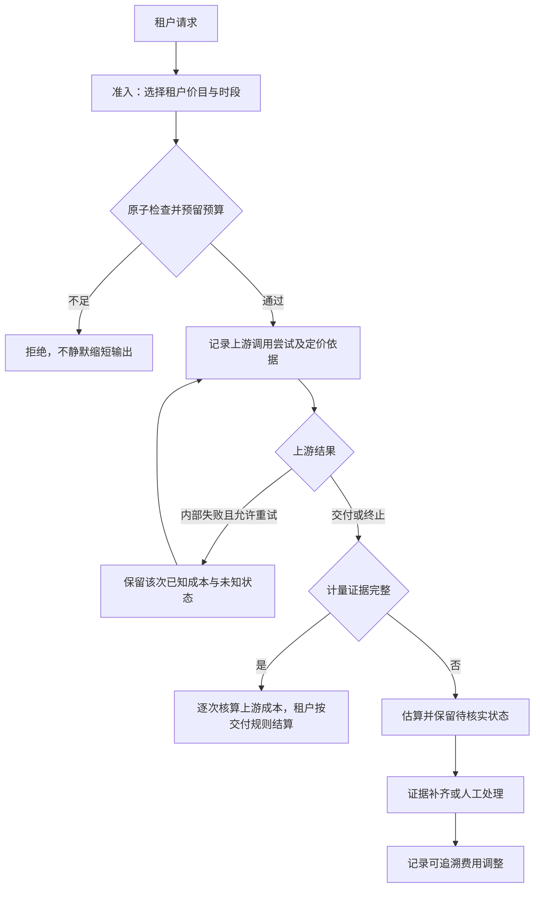

# 峰谷与缓存计费：设计访谈记录

状态：四轮 Q1–Q18 建议已接受；完整设计待最终共同理解确认。核查日期：2026-09-05；第一轮代码基线：`1490100`，最终事实核查 HEAD：`076a1b2d53ba61a4d99db690533ac2a5f1e5b9c4`。本文记录事实与决策，不代表已实现行为或已完成验证。阅读入口为[完整设计](2026-09-05-time-cache-billing-design.md)。

## 外部事实

以本次直接打开的 [DeepSeek 中文价格页](https://api-docs.deepseek.com/zh-cn/quick_start/pricing/)为准：高峰为北京时间周一至周五 09:00–12:00、14:00–18:00，其余为空闲时段。搜索索引仍有“每日高峰”的旧内容，不能据此覆盖当前规则；本次未确认星期规则变更的历史生效日。

人民币价格，单位为每百万 tokens：

| 模型 | 时段 | 缓存命中输入 | 缓存未命中输入 | 输出 |
| --- | --- | ---: | ---: | ---: |
| deepseek-v4-flash | 空闲 | 0.05 | 1.5 | 4.5 |
| deepseek-v4-flash | 高峰 | 0.10 | 3.0 | 9.0 |
| deepseek-v4-pro | 空闲 | 0.15 | 4.5 | 13.5 |
| deepseek-v4-pro | 高峰 | 0.30 | 9.0 | 27.0 |

[Chat Completions API](https://api-docs.deepseek.com/zh-cn/api/create-chat-completion/)规定 `prompt_tokens = prompt_cache_hit_tokens + prompt_cache_miss_tokens`；缓存命中是输入的一个分项。流式响应最终内容块携带整次请求 usage。计价须避免把命中输入同时按普通输入重复计费。

上述价格页未说明跨时段长请求究竟采用接收、开始、完成时间，或按阶段拆分。这是上游待核实事实，不能将 TokenHub 当前做法当成 DeepSeek 的规则。上下文缓存指南抓取超时，本轮缓存字段事实来自 API 文档。

## 当前代码证据

以下为静态阅读结果，本轮没有运行测试或修改计费实现。

| 项目 | 已有能力或缺口 | 阅读入口 |
| --- | --- | --- |
| 时段配置 | 时区、日内起止时间、生效区间；缺少星期条件与缓存价格覆盖 | `backend/internal/server/model_pricing_period_types.go:3` |
| 时段匹配 | 请求开始时间匹配；首个匹配生效；只覆盖普通输入、输出单价 | `backend/internal/server/pricing_periods.go:42` |
| 日期边界 | 支持跨午夜与起含止不含；已有绝对生效时间窗口 | `backend/internal/server/pricing_periods.go:57`、`:186` |
| 上游成本 | 结算阶段读取当前 ProviderModel，然后用请求开始时间匹配该配置 | `backend/internal/server/provider_model_cost.go:68`、`store_routing_calls.go:602` |
| 对外价格 | 准入时将 Model 放入 CallContext | `backend/internal/server/store_call_admission.go:211` |
| DeepSeek 用量 | 读取缓存命中字段，普通输入使用 prompt_tokens 总量；未单独读取 miss 字段 | `backend/internal/server/providers.go:1023` |
| 用量记录 | 已有缓存分桶和金额；缺少计价版本、命中时段、实际单价快照 | `backend/internal/server/types.go:463` |

现有峰谷与缓存能力应作为演进起点。模型目录参考价、Provider 成本价与对外收费价需要分别审视，不能通过一次目录更新推断全部价格已经同步。

第二轮补充核查：TokenHub 已执行预算/配额控制，并非只有展示。准入按累计费用检查限额（`store_call_admission.go:198`、`store_backup_quota.go:955`），结算累计 `usage.CostUSD`（`store_helpers.go:347`、`store_routing_calls.go:696`）。现有金额检查未预留本次预计金额（`store_helpers.go:327`），不能称为防超支钱包或余额冻结流程。本次有限阅读未发现租户充值钱包账本。

第二轮官方资料检索仍未确认 DeepSeek 跨时段请求的计价时间依据；历史转载或其他供应商的时间定义均不能替代其当前官方规则。

第四轮补充静态核查：

- 当前 Go 后端未找到独立 `Tenant` 实体。Project 关联 Team、OwnerUser、CostCenter，API Key 关联 Project、OwnerUser（`types.go:98`）；运行预算 scope 包含 project、team、cost_center、global/organization，用户/API Key 另有 quota（`store_backup_quota.go:1096`）。本文“租户费用”为收费领域概念，不代表已存在或已决定新增 Tenant 表。
- 已有准入事务、scope 锁及 token 预留，但没有本次费用金额预留（`store_routing_calls.go:451`、`store_call_admission.go:267`）。quota 日/月桶按 `StartedAt` 的 UTC 日期，运行预算却按结算写入的 `UsageRecord.created_at` 汇总（`store_routing_calls.go:685`、`store_helpers.go:416`、`store_backup_quota.go:1021`）；统一归期是一项实际行为变化，需通过跨月验收。
- 当前核心 cost/balanced 路由使用配置的 CostScore 等分数，不直接读取实际模型/Provider 单价（`gateway_http.go:1083`、`:1149`）。本期不应将版本化单价自动接入该评分行为。
- 已有 RouteAttemptLog 和上游请求 ID 证据，但 attempt 缺 ProviderCost 与缓存写入有效期细分，且单独写入、错误被忽略（`store_routing_calls.go:1464`、`:911`）；不能直接将其当作可靠成本账本。最终结算已有 request_settlement 锁和 RequestLog 去重（`:629`），新设计需保留且扩展其事务不变量。

## 领域术语

- 上游成本：TokenHub 因调用供应商而承担的费用；本地计算与供应商账单确认的成本应有可区分状态。
- 租户费用：按 TokenHub 与租户的收费规则计算的费用；内部费用分摊也需说明是否沿用此概念。
- 计费时段：由价目规则的时区、星期和时间窗口界定的价格适用区间；与实时系统负载分开。
- 上游缓存读取：供应商报告为缓存命中的输入用量。
- 上游缓存写入：供应商独立计量的缓存创建用量，可能有不同有效期；不是所有供应商都单列收费。
- 网关响应缓存：由 TokenHub 复用已有响应而免去本次上游调用的机制，其计量和收费语义需另行约定。

已确认术语逐轮写入根目录 `CONTEXT.md`，包括费用分离、价目与版本、预算预留、待核实用量、上游调用尝试及计费时段。具体供应商账单确认状态仍需在实现设计中明确，不能将估算视为对账完成。

## 计价表达与剩余候选细节

将计费表达为“用量分项 × 适用价目版本 × 计费时段”。针对 DeepSeek，费用为：

```text
费用 = (未命中输入量 × 未命中输入单价
      + 命中输入量 × 命中输入单价
      + 输出量 × 输出单价) / 1,000,000
```

三项单价均可随时段变化。通用模型为缓存写入及不同有效期保留独立维度，但不凭空给 DeepSeek 添加未公布的收费项。缓存分项未知不能冒充实测零用量。

第二轮已确认保留独立的上游与租户价目、价格版本和原币金额，另记折算金额与汇率依据。人民币价不能直接写入当前名称为 USD 的字段。第三轮已确认租户准入时锁定价目与时段、用量未知时保留待核实状态；汇率锁定时点和长期未核实的处理见第四轮。

## 第一轮：已完成

1. **计费对象**：仅核算上游成本/内部预算，还是同时设计向租户扣费？建议分别建模上游成本与租户费用，并明确首期实际启用范围。
2. **缓存范围**：只处理上游报告的缓存读写，还是本期也设计 TokenHub 响应缓存？建议首期完成上游缓存计量计价，网关响应缓存独立设计。
3. **供应商范围**：DeepSeek 专用修补，还是通用计价能力？建议通用的数据与规则模型，先用 DeepSeek 的峰谷与缓存案例验证。

用户回复“ok”，按接受上述三项建议记录：分别建模上游成本与租户费用；首期处理上游缓存计费，网关响应缓存独立设计；通用规则模型，DeepSeek 首先验证。该回复未确定首期是否实际执行租户扣费，也未接受全部后续候选设计。决策见 [ADR-0009](../adr/0009-separate-provider-cost-and-tenant-charge.md)。

术语表与 ADR 保存在本地；现有 `.git/info/exclude` 排除了 `/CONTEXT.md` 与 `/docs/adr/`，本轮保留该仓库设置。

## 第二轮：已完成

4. **首期收费用途**：首期改进现有成本、费用归集及预算控制，还是新增租户充值钱包与实际余额扣款？建议首期接入现有预算/配额路径，钱包结算单独立项。此问题未由第一轮的概念分离决定。
5. **租户定价政策**：设计上选择独立价目、成本加价还是成本直通？建议独立租户价目，支持普通输入、缓存读写和输出分别定价；上游峰谷变化不自动改变租户售价。即使首期只归集成本，也可先确认这一设计方向。
6. **币种策略**：仅按现有 USD 核算，还是保留上游价目的原币金额并另行折算？建议保留上游原币金额，折算与原币分开记录；具体汇率来源、生效时点和租户结算币种在选定方向后继续确认。
7. **价格发布与历史依据**：供应商价格变化是否直接影响在途请求与历史账单？建议管理员发布带生效时间的不可变价格版本，在途请求固定已选依据，历史账单保留原记录；修正通过可追溯调整表达。上游时间依据须按供应商规则核实，不能与租户定价时点混为一谈。

用户再次回复“ok”，按接受 Q4–Q7 建议记录：首期完善现有预算控制而不新增钱包；独立租户价目；保留上游原币及折算依据；带生效时间的价格版本，在途请求固定已选依据，历史费用通过调整修正。见 [ADR-0009](../adr/0009-separate-provider-cost-and-tenant-charge.md) 与 [ADR-0010](../adr/0010-preserve-billing-price-and-currency-evidence.md)。

本轮检查被 Git 排除的既有 ADR 后，将本次范围 ADR 从误用的 0001 改为 0009，保持既有 0001–0008 不变。

## 第三轮：已完成

8. **预算准入**：允许请求结束后才发现超额，还是开始前按本次可能费用占用预算？建议按输入全部未命中、允许的输出上限和已选租户价目保守预留，并原子检查“已用＋在途预留＋本次预留”；结束按用量结算。预留不足则拒绝或由调用方降低输出上限，不静默截断。估算边界未证明前不承诺绝对零超支。
9. **用量缺失**：供应商缺少 usage、缓存分项或流式连接提前断开时，是否按零或按普通输入结算？建议记录估算/待核实状态与缺失分项，不将未知当零，也不将估算直接标成最终费用。上游证据补齐后用调整记录修正；未解决项目的保留期限及人工处理在此方向确定后继续确认。
10. **重试费用归属**：平台失败重试或切换供应商产生多次上游消耗，是否全部转给租户？建议上游按每次尝试记录已知成本与未知状态；租户只计一次实际交付对应的用量，不承担平台内部失败重试。部分交付和客户端主动重发需另行界定。
11. **跨时段时间依据**：对于 08:59:59 开始、09:01 完成的请求，租户费用按哪个时段？建议租户在平台准入时锁定价目和时段，整次请求一致。上游成本按供应商正式规则；DeepSeek 规则未确认期间，以每次上游发送时点作显式估算并保留时间证据，不能声称与供应商账单严格一致。
12. **核算币种与汇率操作**：建议首期租户价目与预算保持 USD，上游成本保留原币；由管理员发布带生效时间的汇率版本，保留所用版本，具体锁定时点在 Q11 方向确认后确定。外币成本另保留原币证据，缺少适用汇率时标记折算待定，不伪造换算结果。是否接受 USD 作为首期统一预算币种及人工汇率管理？
13. **价格对路由与发布的影响**：建议首期由管理员确认并发布价目，上游公开目录更新只生成候选变更；计价能力不新增按时段自动换供应商、排队等低谷执行或缓存亲和路由。既有路由行为仍须检查，不据此假定价格永远不会参与现有路由。

用户第三次回复“ok”，按接受 Q8–Q13 建议记录：原子预留与结算；usage 缺失不当零；平台失败重试不转嫁租户；租户准入锁定时段、DeepSeek 上游时间暂作显式估算；USD 预算和人工发布汇率；管理员确认价目、本期不新增低谷调度。决策见 ADR-0009、ADR-0010、ADR-0011。

## 已确认的请求流程



部分交付、预留释放及超过 24 小时转人工处理的规则已在第四轮确认，详细状态关系见完整设计。

## 第四轮：已完成

14. **部分交付与重复请求**：建议已交付部分回答不整单免费，只按可确认的交付用量结算，无法分离的用量进入待核实。平台内部重试沿用同一租户调用，重复结算不能重复计费；客户端主动重新提交默认是新调用。首期不凭客户端自填 request_id 免费去重，也不新增响应重放型幂等 API。
15. **预留上界与异常恢复**：Q8 的“全部未命中”只足以描述 DeepSeek 三项价目的保守输入场景。若允许配置缓存写入价高于普通输入价，通用预留应改为所有可能计费分项在合法组合下的费用上界，加允许的输出上限；无法提供可靠上界时不得宣称严格防超支。建议无法安全估计时拒绝该模型的严格预算调用并提示配置原因。确认未发往上游的失败释放预留；已发送但缺用量的请求保留预算占用及待核实记录，超过 24 小时进入人工处理队列并告警，不自动清零或全额转最终消费。预算周期统一沿用现有 quota 的 UTC 日/月定义，租户费用与预留归准入时锁定的周期，后续调整关联原周期；价目时段仍使用各价目指定的 IANA 时区，两者不混用。
16. **价目配置与免费语义**：建议初期沿用现有模型售价范围，以及项目、团队、成本中心、用户/API Key 等现有预算/限额主体和权限边界，不新增 Tenant 实体或逐用户议价体系。时段采用明确 IANA 时区、星期及左闭右开窗口；每日默认价加互不重叠的时段覆盖。覆盖项未配置可显式继承默认价，基础必需价格缺失则拒绝发布；零价只在明确配置为免费时成立。上游缺价记成本未知，不从租户售价反推。原币、换算金额与所有计费分项使用可复算十进制定点规则，不能逐 token 舍入；精度和最终舍入时点在完整设计中列明并待最终确认。
17. **汇率、权限与成本可见性**：建议每次上游调用尝试锁定发送时适用的已发布汇率版本，以原币记录为依据，缺汇率只让成本折算待定，不将其算零；USD 租户预算仍可独立执行。价格、汇率发布与费用调整仅允许获授权管理员操作并记录原因与审计；供应商成本和利润不扩大给普通调用用户，仅展示其授权范围的用量、租户费用、预留及待核实状态。具体角色映射遵循现有权限。
18. **上线与历史记录**：建议从明确切换时间启用新计价，旧记录保留原金额并标记历史依据不足，不伪造价格版本或缓存分项，不追溯重算历史费用。先进行影子计算与对账验证，再切换预算执行；通用模型设计不等于所有供应商已验证，首个验收供应商为 DeepSeek。

用户第四次回复“OK”，按接受 Q14–Q18 建议记录。已更新术语表和 ADR-0010、ADR-0011；下一步是确认完整设计的整体理解，不再将已确认问题重新提问。

最终事实刷新：指定 11 个计费核心文件在 `1490100` 与 `076a1b2` 之间仅 `gateway_http.go` 有旧包装函数删除，cost/balanced 路由逻辑未变，其余 10 个文件无差异；前述代码结论继续成立。这是源码比较，不是测试结果。

## 后续收敛项

- 四轮业务决策已完成；数据关系、字段与状态、金额精度建议、现有结构演进点及验收矩阵已汇总为完整设计，待最终共同理解确认。
- 外部待核实项：DeepSeek 跨峰谷计价时间依据，以及当前星期规则的历史生效时间；不以平台选择替代上游正式证据。
- 验收覆盖：并发预留、费用上界、崩溃恢复、周末/午夜/改价、重试/部分交付/重复结算、缺失分项/免费价格、原币折算和对账差异。

## 关联 issue 范围补充

用户提出结合 #208、#304、#138、#264、#259、#221、#76、#77、#177、#178、#246 等问题评估同批解决范围。已刷新 GitHub 状态，补充同源 usage 的协议投影、零值 PATCH 语义、归属显示证据、跨实例金额控制和既有账单对接约束；另将 #83 限流合同与 #266 报表日界纳入回归，#135 前缀缓存优化保持独立。详见[issue 纳入清单](2026-09-05-time-cache-billing-issues.md)。完整设计的验收矩阵由 19 项扩展至 25 项。

此轮执行了 8 项已有后端聚焦测试，结果和适用边界记录于清单。它们验证已有行为回归，不证明新增计价能力、浏览器复现、多实例金额预留或生产部署已通过。

实现修改、提交、推送或发布均未在本次设计访谈中执行。最终整体确认也不应被解释成提交、推送或发布授权。

## 文档归档更新（2026-09-05）

上述本地排除说明记录了当时的工作状态。本次归档已将 `CONTEXT.md`、`docs/adr/` 与相关讨论记录纳入版本管理；设计决定仍不代表实现或验收完成。
